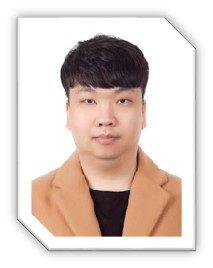
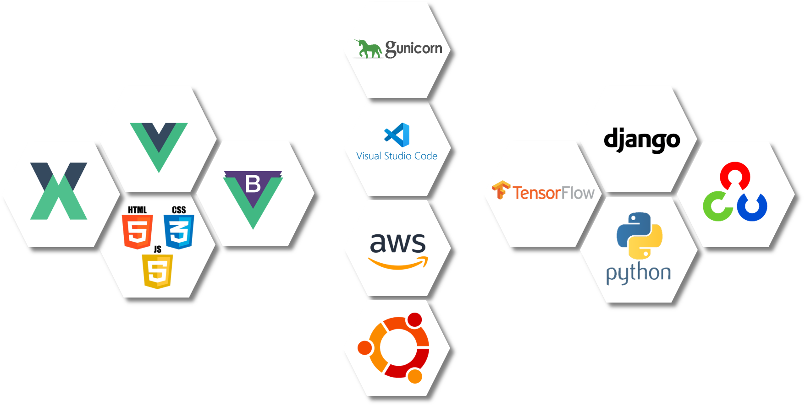

# README

> 특화 프로젝트 C205팀의 리드미 입니다 :)

### 

> 사용자가 입력한 이미지의 관상을 봐주는 서비스 입니다.

## 📱 기획의도

> 
>

## 📅 개발 계획 or Flow Chart

## 🧞‍♂️ 역할?팀원?소개

### **Frontend**

|  |  |  |
| :-----------------------------------------------: | :-----------------------------------------------: | :-----------------------------------------------: |
|                    **고성진**                     |                    **김다영**                     |                    **임도현**                     |

### **Backend**    

|  |  |  |
| :-----------------------------------------------: | :-----------------------------------------------: | :-----------------------------------------------: |
|                    **김정원**                     |                    **김영환**                     |                    **김익한**                     |

## 🎮 Tools / 기술스택

### 

## (🔀 DB 모델링)

## 🧾 주요기능

#### 핵심기능

- 사용자의 얼굴을 눈, 코, 입, 눈썹으로 분할하여 세부적인 관상 정보를 제공합니다.
- 관상 정보를 종합하여 조선시대 직업으로 나타냅니다.
- 이름 두개를 입력받아 궁합을 계산합니다.
- 사용자의 나이를 입력받아 하루 24시간으로 변환합니다.

#### 부가기능

- 각 결과 화면 공유하기 기능
- 

## 🦸‍♂️ 학습원리

## 😂 느낀점

- 고성진

  > 

- 김다영

  > 

- 김영환

  > 

- 김익한

  > 

- 김정원

  > 

- 임도현

  > 

## 💻 ETC
