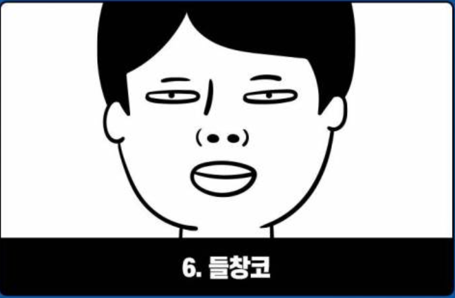
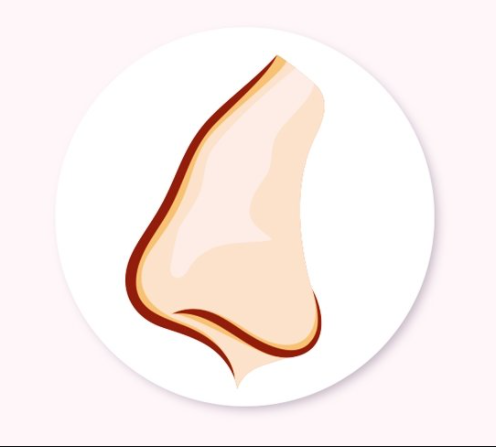

# 얼굴 데이터 학습 - 코

> 한국인 평균 코 모양은 남녀(cm)
>
> 길이: 4.08, 3.68, 높이: 5.31. 4.84, 인중: 4.19, 3.85, 콧방울 넓이: 4.33, 4,12 cm^2

#### 분류 : 크기 / 모양

1. 큰 코
   - 자기 중심적임.
   - 자기주장이 강해 대인관계에서 상대방을 배려하지 못해 고독한 경우도 있음.
2. 작은 코
   - 자신감이 부족하고 소극적이며, 피동적인 생활을 하기 쉽다.
   - 매사에 주저를 많이 하고 성사될 일도 주저하는 바람에 실패할 경우도 있음.
3. 긴 코
   - 사고력과 이해력이 풍부하며, 도덕성도 뛰어나고 규칙적인 심성의 소유자이지만 실천력이 부족하고 때로는 이론에만 치우치는 경우도 있다.
   - 고상한 것을 좋아해서 고급스러운 취미를 갖는 경우가 많음.
4. 짧은 코
   - 속전속결파임.
   - 어디든지 잘 적응하며 행동이 싹싹함.
   - 경거망동에 주의해야하고 신념이 부족하나 예감력은 있다.
5. 넓은 코폭
   - 은폐적으로 능글맞고 공명정대하지 못하고, 희노애락 표현이 폐쇄적이다
   - 식욕, 성욕, 물욕이 강함.
6. 좁은 코폭
   - 언행이 단순하고 숨김 없이 솔직 담백함.
   - 신경질적이고 소극적인 면이 있으며 기력과 재물이 약함.

1. 틀어진 코
   - 인생의 변화가 많으며, 좌는 틀어진 경우 부모와 우는 처로 인한 일이다.
2. 딸기 코
   - 손재가 많고 항상 분주하며 금전운도 좋지 않음.
   - 파란이 많으며 처자의 인연도 박함.
3. 뾰족한 코
   - 인색하고 심성이 악함.
   - 재간은 있으나 간사하고 외롭고 가난하다.
4. 들창 코
   - 원망이 많으며 허풍과 허영이 있을 수 있고 낭비벽이 심함.
   - 재물이 쉽게 모이지 않으며 유혹에 빠지기 쉬움.
5. 매부리 코
    - 물직욕이 강하고, 내정하며 이기적이나 인내심이 강하다.

- 뾰족한코

  

  

- 들창코

  

- 매부리코

