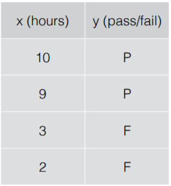
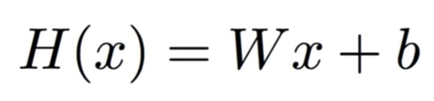
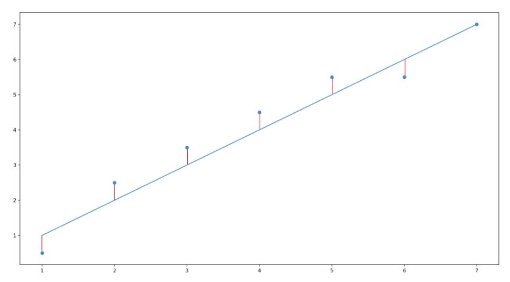

## Machine Learning 이란?

- Limitations of explicit programming

#### 1) Supervised learning

- 정답을 알려주며 학습시키는 것

1-1) 분류(classification)

- 이진 분류

>어떤 데이터에 대해 두 가지 둥 하나로 분류할 수 있는 것

- 다중 분류

>어떤 데이터에 대해 여러 값 중 하나로 분류할 수 있는 것

1-2) 회귀(regression)

>데이터들의 특징을 토대로 값을 예측하는 것

### 2)  Unsupervised learning

- 정답을 따로 알려주지 않고 학습시키는 것

>어떤 데이터들을 비슷한 데이터 끼리 모아 군집화 하는 것
>
>예를 들어 뉴스 그륩핑, 단어 군집화

### 3) Linear Regression (선형 회귀)

>데이터를 가장 잘 대변하는 직선의 방정식을 찾는 것

 ##### Hypothesis

>이 직선의 방정식을 찾기 위해 Hypothesis(가설)을 세운다

>W값과 b값을 찾아내는 것이 선형 회귀의 목적이다

 ##### Cost

 >직선이 현재 데이터를 얼마나 잘 표현하는지를 측정하기 위해 Cost function이란 함수를 쓰게 된다.

 

 >여기서 실제 데이터의 y 값과 직선이 예측한 y 값의 차이를 이용해 비용을 계산하고
 >
 > 이 비용이 최소가 되는 직선을 찾는 것이 선형 회귀의 목적이다
