# OpenCV

### 컴퓨터 비전을 위한 OpenCV(컴퓨터비전 == 컴퓨터에서 보여지는 내용)

- 영상 처리와 컴퓨터 비전을 위한 오픈소스 라이브러리
- C, C++, Python 등에서 사용가능(특히 python에서 강력하게 지원하고 있다.)

- 쉬우면서도 강력한 기능을 제공한다. 


### 1. OpenCV 기본 사용법 

#### 1-1 OpenCV 설치

``` python
python -m pip install opencv-python

import cv2
print(cv2.__version__)

결과가 4.1.0이 출력되면 정상적인 설치완료
```


#### 1-2 OpenCV 기본함수

```  python
cv2.imread(file_name, flag): 이미지를 읽어 Numpy 객체로 만드는 함수
	- file_name: 읽고자 하는 이미지 파일명
    - flag: 이미지를 읽는 방법 설정
        IMREAD_COLOR: 이미지를 Color로 읽고, 투명한 부분은 무시
        IMREAD_GRAYSCALE: 이미지를 Grayscale로 읽기
        IMREAD_UNCHANGED: 이미지를 Color로 읽고, 투명한 부분도 읽기(Alpha)
반환 값: Numpy 객체(행, 열, 색상:기본 (B,G,R)) -> RGB에서 R과 B가 바뀜
```

```
cv2.imshow(title, image): 특정한 이미지를 화면에 출력하는 함수
	- title: 윈도우 창의 제목
	- image: 출력할 이미지 객체
```

``` python
cv2.imwrite(file_name, image): 특정한 이미지를 파일로 저장하는 함수
    - file_name: 저장할 이미지 파일 이름
    - image: 저장할 이미지 객체
```

```
cv2.waitKey(time): 키보드 입력을 처리하는 함수
	- time: 입력 대기 시간(무한대기: 0)
반환 값: 사용자가 입력한 Ascii Code(ESC:27)
```

``` python
cv2.destroyAllWindows(): 화면의 모든 윈도우를 닫는 함수
```

#### 1-3 이미지 출력 예제

``` python
import cv2

img_basic = cv2.imread('bear.jfif', cv2.IMREAD_COLOR) #칼라 포함해서 읽기
cv2.imshow('Image Basic', img_basic) #읽어드린 이미지를 화면에 보여주기
cv2.waitKey(0) # 이미지를 보여주고 꺼지지 않도록 
cv2.imwrite('result.png', img_basic) # 이미지 저장하기


img_gray = cv2.cvtColor(img_basic, cv2.COLOR_BGR2GRAY) #이미지를 그레이컬러로 읽기
cv2.imshow('Image Gray', img_gray) 
cv2.waitKey(0)
cv2.imwrite('result2.png', img_gray)
```

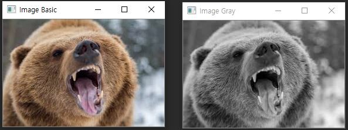


### 2. OpenCV 이미지 연산

#### 2-1 이미지 크기 및 픽셀 확인

``` python
import cv2

img = cv2.imread('bear.jfif') # 이미지 불러오기
print(img.shape) # 이미지의 높이, 너비, 채널 출력, 채널이 3일 경우 다색, 1일 경우 단색 이미지
print(img.size)	 # 이미지 픽셀 수 출력

px = img[100, 100] # 이미지 Numpy 객체의 특정 픽셀
print(px) # (B,G,R) 순서로 출력 단, Gray Scale의 경우는 흑백 정보만 있으므로 제외

print(px[2]) # BGR중 R값만 출력하기
```

결과 값 출력

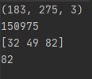

#### 2-2 특정 범위 픽셀 변경하기

``` python
import cv2
import time

img = cv2.imread('bear.jfif')

# 반복문으로 픽셀 변경하기, 하나하나 접근해서 값을 바꾸기 때문에 느리다.
start_time = time.time()
for i in range(0,100):
    for j in range(0,100):
        img[i,j]= [255, 255, 255]
print("---%s seconds ---" % (time.time() - start_time))

# 슬라이싱으로 픽셀 변경하기
start_time = time.time()
img[0:100, 0:100] = [0,0,0]
print("---%s seconds ---" % (time.time() - start_time))

cv2.imshow('Img', img)
cv2.waitKey(0)

# 딱 봐도 슬라이싱한 시간이 훨씬 빠르다는 것을 알 수 있다.
---0.014002799987792969 seconds ---
---0.0 seconds --- 
```

결과 값 출력


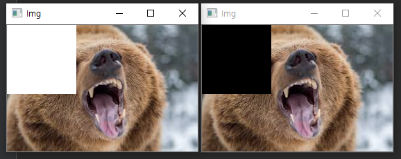


#### 2-3 ROI 추출 및 복사 (ROI == Region of Interest, 관심있는 부분)

``` python
import cv2

img = cv2.imread('bear.jfif')

roi = img[100:150, 200:250] # Numpy Slicing하여 roi에 저장
img[0:50, 0:50] = roi # ROI 단위로 이미지 복사하기

cv2.imshow('Img', img)
cv2.waitKey(0)
```


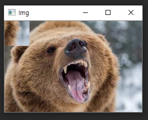

#### 2-4 픽셀별로 색상 다루기

``` python
import cv2

img = cv2.imread('bear.jfif')

cv2.imshow('Img', img[:,:, 0]) # 특정 색상만 보여주기
cv2.waitKey(0)

img[:,:, 2] = 0		# 특정 색상 제거하기,BGR에 인덱스 2번을 0으로 만들어주기 때문에 레드색상 제거
cv2.imshow('Img', img)
cv2.waitKey(0)
```

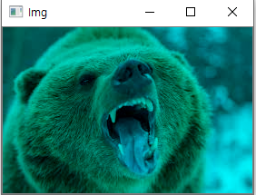


### 3. OpenCV 이미지 변형

#### 3-1 이미지 크기를 줄이거나 늘릴 때 그 안에 픽셀들을 어떻게 채울 것인가?

#### 보간법(Interpolation)

- 보간법은 사이즈가 변할 때 픽셀 사이의 값을 조절하는 방법을 의미한다.

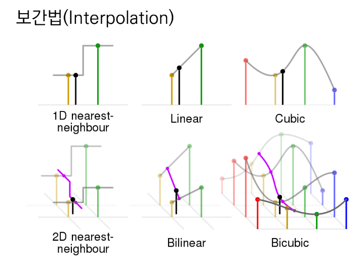

#### 이미지 크기 조절

```
cv2.resize(image, dsize, fx, fy, interpolation): 이미지의 크기를 조절합니다.
- dsize: Manual Size
- fx: 가로 비율
- fy: 세로 비율
- interpolation: 보간법
INTER_CUBIC: 사이즈를 크게 할 때 주로 사용
INTER_AREA: 사이즈를 작게 할 때 주로 사용

```


#### 3-2 이미지 크기 변경 예제

``` python
import cv2

img = cv2.imread('bear.jfif')
cv2.imshow('Img', img)
cv2.waitKey(0)

expand = cv2.resize(img, None, fx=2.0, fy=2.0, interpolation=cv2.INTER_CUBIC)
cv2.imshow('Expand', expand)
cv2.waitKey(0)

shrink = cv2.resize(img, None, fx=0.5, fy=0.5, interpolation=cv2.INTER_AREA)
cv2.imshow('Shrink', shrink)
cv2.waitKey(0)
```

결과값 출력

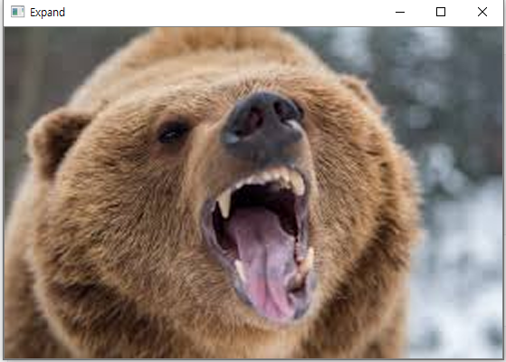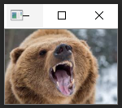


#### 3-3 이미지 위치 변경

``` python
cv2.warpAffine(image, M, dsize): 이미지의 위치를 변경합니다.
- M: 변환 행렬
- dsize: Manual Size
```

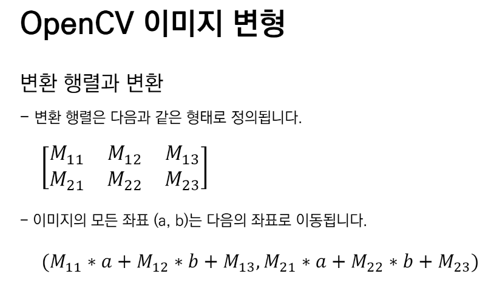

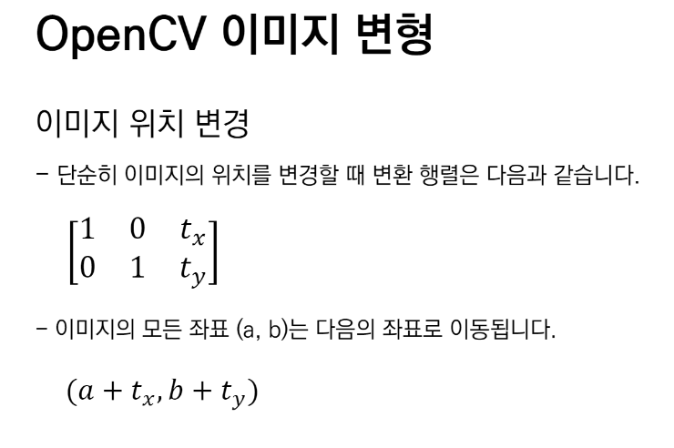

#### 3-4 이미지 위치 변경

``` python
import cv2
import numpy as np

img = cv2.imread('bear.jfif')

height, width = img.shape[:2] # 행, 열 정보만 저장

M = np.float32([[1, 0, 50], [0, 1, 10]]) # x축으로 50px, y축으로 10px 이동
dst = cv2.warpAffine(img, M, (width, height))
cv2.imshow('Img', dst)
cv2.waitKey(0)
```

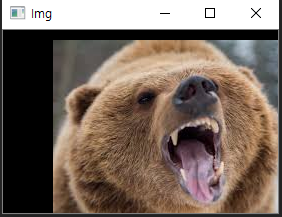

#### 3-5 이미지 회전

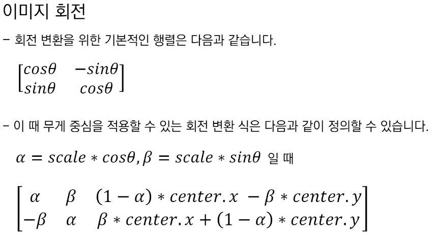

```
cv2.getRotationMatrix2D(center, angle, scale): 이미지 회전을 위한 변환 행렬을 생성합니다.
- center: 회전 중심
- angle: 회전 각도
- scale: Scale Factor
```


이미지 회전실습

``` python
import cv2

img = cv2.imread('bear.jfif')

height, width = img.shape[:2] #높이와 너비를 각각 저장

#너비와 높이를 절반으로 해서 정중앙을 센터로 잡는다.
M = cv2.getRotationMatrix2D((width / 2, height / 2), 90, 0.5)
dst = cv2.warpAffine(img, M, (width, height))
cv2.imshow("img", dst)
cv2.waitKey(0)
```

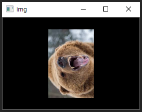


### 4. OpenCV 이미지 합치기

#### 4-1 이미지 합치기

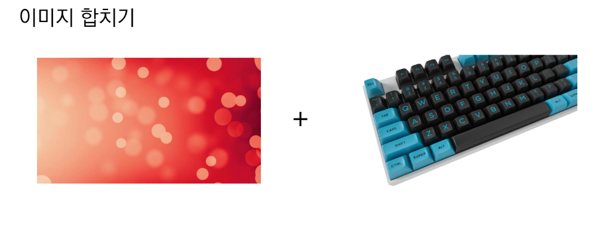

#### 4-2이미지 합치는 2가지 방법

1. cv2.add(): Saturation 연산을 수행

   0보다 작으면 0, 255보다 크면 255로 표현

2. np.add(): Modulo 연산을 수행

   256은 0, 257은 1로 표현

``` python
import cv2

image_1 = cv2.imread('image_1.jpg')
image_2 = cv2.imread('image_2.jpg')

result = cv2.add(image_1, image_2)
cv2.imshow('Image', result)
cv2.waitKey(0)

# 두 이미지의 특정 픽셀에 관해서 255가 넘어가면 다시 0부터 시작하므로 색상이 깨짐
result = image_1 + image_2
cv2.imshow('Image', result)
cv2.waitKey(0)
```

#### Saturation으로 연산시 result

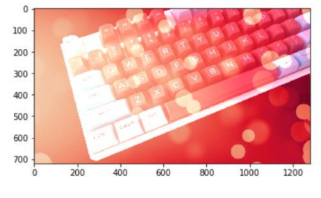

#### Modulo 연산시 result

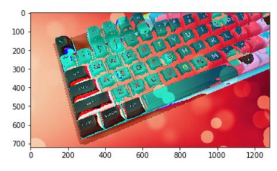


