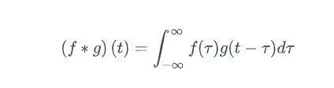
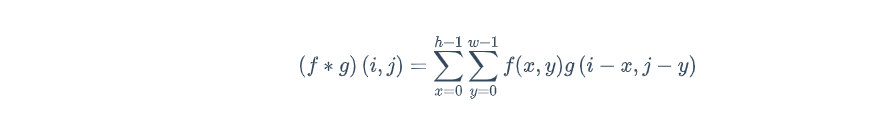
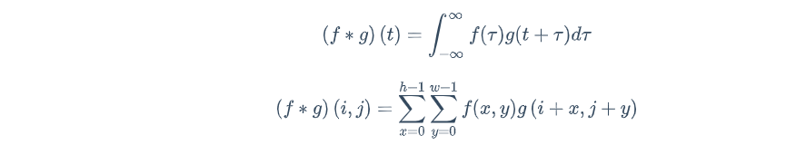
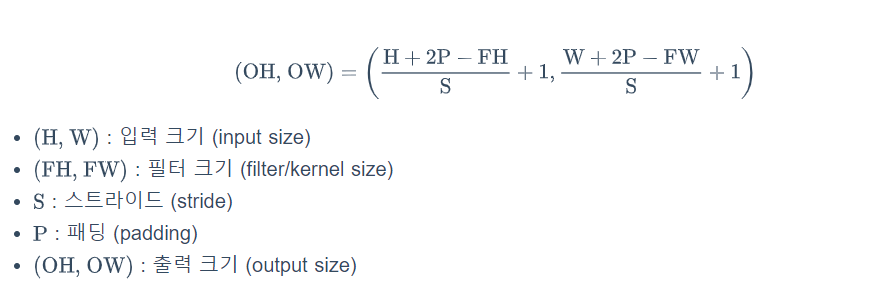
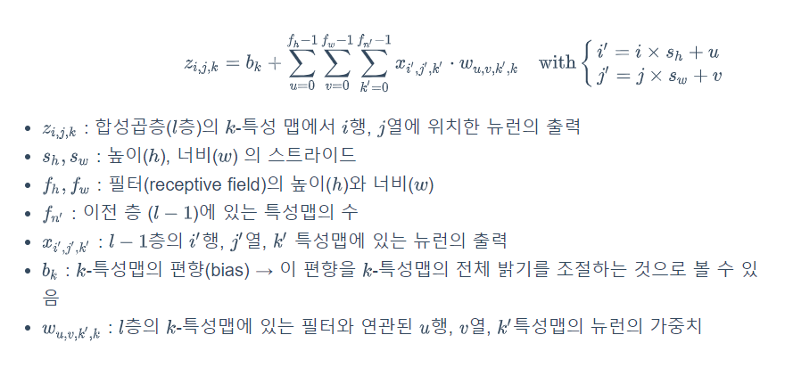

> 필수지식학습 중 2. 자연어처리(NLP, RNN)에 관한 내용
>
> (명세서 학습 링크 페이지)

# PJT2_Sub2 필수지식학습

## 1. 이미지 처리 

## (1) CNN(합성곱 신경망, Convolutional Neural Networks)


## ① 기본 연산들

> 컨볼루션 신경망에 사용되는 다양한 연산들에 대한 설명
>
> https://excelsior-cjh.tistory.com/180

### 1. CNN의 기원

David H. Hubel과 Torsten Wiesel은 1958년과 1959년에 시각 피질의 구조에 대한 결정적인 통찰을 제공한 고양이 실험을 수행했다. 이들은 시각 피질 안의 많은 뉴런이 작은 **local receptive field**(국부 수용영역)을 가진다는 것을 보였으며, 이것은 뉴런들이 시야의 일부 범위 안에 있는 시각 자극에만 반응을 한다는 의미이다. 뉴런의 수용영역(receptive field)들은 서로 겹칠수 있으며, 이렇게 겹쳐진 수용영역들이 전체 시야를 이루게 된다. 추가적으로 어떤 뉴런은 수직선의 이미지에만 반응하고, 다른 뉴런은 다른 각도의 선에 반응하는 뉴런이 있을 뿐만아니라, 어떤 뉴런은 큰 수용영역을 가져 저수준의 패턴(edge, blob 등)이 조합되어 복잡한 패턴(texture, object)에 반응하다는 것을 알게 되었다.  이러한 관찰을 통해 고수준의 뉴런이 이웃한 저수준의 뉴런의 출력에 기반한다는 아이디어를 생각해 냈다. (아래 그림출처 : [brainconnection](https://brainconnection.brainhq.com/2004/03/06/overview-of-receptive-fields/))


이러한 아이디어가 바로 **합성곱 신경망(CNN, Convolutional Neural Network)**으로 점차 진화되어 왔으며, 1998년 Yann Lecn et al.의 논문에서 손글씨 숫자를 인식하는데 사용한 LeNet-5가 소개 되면서 CNN이 등장하게 되었다.

CNN의 구조는 아래의 그림과 같이 완전연결(fully connected)계층과는 달리 CNN은 **합성곱층(covolutional layer)**과 **풀링층(pooling layer)**으로 구성되어 있다.


### 2. 합성곱층 (Convolutional layer)

#### 2.1 완전연결 계층의 문제점

완전연결 계층(fully connected layer)을 이용해 MNIST 데이터셋을 분류하는 모델을 만들 때,  3차원(세로, 가로, 채널)인 MNIST 데이터(28, 28, 1)를 입력층(input layer)에 넣어주기 위해서 아래의 그림(출처: [cntk.ai](https://cntk.ai/pythondocs/CNTK_103A_MNIST_DataLoader.html))처럼, 3차원 → 1차원의 평평한(flat) 데이터로 펼쳐줘야 했다.  즉, (28, 28, 1)의 **3차원 데이터를 28x28x1의 1차원 데이터로 바꾼다음 입력층에 넣어줬다.**


이러한 완전연결 계층의 문제점은 바로 **'데이터의 형상이 무시'**된다는 것이다. 이미지 데이터의 경우 3차원(세로, 가로, 채널)의 형상을 가지며, 이 형상에는 **공간적 구조(spatial structure)**를 가진다. 예를 들어 공간적으로 가까운 픽셀은 값이 비슷하거나, RGB의 각 채널은 서로 밀접하게 관련되어 있거나, 거리가 먼 픽셀끼리는 관련이 없는 등, 이미지 데이터는 3차원 공간에서 이러한 정보들이 내포 되어있다. 하지만, **완전연결 계층에서 1차원의 데이터로 펼치게 되면 이러한 정보들이 사라지게 된다.**


#### 2.2 합성곱층

합성곱층은 CNN에서 가장 중요한 구성요소이며, 2.1의 완전연결 계층과는 달리 **합성곱층(convolutional layer)**은 아래의 그림과 같이 입력 데이터의 형상을 유지한다. 3차원의 이미지 그대로 입력층에 입력받으며, 출력 또한 3차원 데이터로 출력하여 다음 계층(layer)으로 전달하기 때문에 CNN에서는 이미지 데이터처럼 형상을 가지는 데이터를 제대로 학습할 가능성이 높다고 할 수 있다.


   

합성곱층의 뉴런은 아래의 그림처럼(출처: [towardsdatascience.com](https://www.google.co.kr/url?sa=i&source=images&cd=&cad=rja&uact=8&ved=2ahUKEwiisMajvYzeAhWBzbwKHQwADpsQjhx6BAgBEAM&url=https%3A%2F%2Ftowardsdatascience.com%2Fintuitively-understanding-convolutions-for-deep-learning-1f6f42faee1&psig=AOvVaw2rBeiGhqGeRHABcckWUyi1&ust=1539831412136958)) 입력 이미지의 모든 픽셀에 연결되는 것이 아니라 합성곱층 뉴런의 **수용영역(receptive field)안에 있는 픽셀에만 연결**이 되기 때문에, 앞의 합성곱층에서는 저수준 특성에 집중하고, 그 다음 합성곱층에서는 고수준 특성으로 조합해 나가도록 해준다. 


#### 2.3 필터 (Filter)

위에서 설명한 수용영역(receptive field)을 합성곱층에서 **필터(filter)** 또는 커널(kernel)이라고 한다. 아래의 그림처럼, 이 필터가 바로 합성곱층에서의 가중치 파라미터(`W`)에 해당하며, 학습단계에서 적절한 필터를 찾도록 학습되며,  합성곱 층에서 입력데이터에 필터를 적용하여 필터와 유사한 이미지의 영역을 강조하는 **특성맵(feature map)**을 출력하여 다음 층(layer)으로 전달한다.


그렇다면, 입력 데이터와 필터에 어떠한 연산을 통해 특성맵을 출력하는지에 대해 알아보도록 하자.


#### 2.4 합성곱 (Convolution) vs. 교차 상관 (Cross-Correlation)

합성곱은 *'하나의 함수와 또 다른 함수를 **반전** 이동한 값을 곱한 다음, 구간에 대해 적분하여 새로운 함수를 구하는 연산자이다'* 라고 [wikipedia](https://ko.wikipedia.org/wiki/합성곱)에서 정의하고 있다. 합성곱 연산은 푸리에 변환(Fourier transform)과 라플라스 변환(Laplace transform)에 밀접한 관계가 있으며 신호 처리 분야에서 많이 사용된다. 



이미지의 경우 2차원의 평면(높이h , 너비w )이며, 픽셀로 구성되어 있어 아래와 같이 (∑)를 이용해 나타낼 수 있으며, 한 함수가 다른 함수 위를 이동하면서 원소별(element-wise) 곱셈의 합을 계산하는 연산이다.



합성곱과 매우 유사한 연산을 하는 **교차 상관(cross-correlation)**이 있는데, 교차상관의 식은 다음과 같다.



합성곱과 교차상관의 차이는 한 함수(위에서 )를 반전()하는 것만 빼고는 동일한 함수이다. 


CNN의 합성곱층(convolutional layer)에서는 합성곱이 아닌, 교차상관(cross-correlation)을 사용하는데, 그 이유는 합성곱 연산을 하려면, 필터(filter/kernel)를 뒤집은(반전) 다음 적용해야 한다. 그런데, CNN에서는 필터의 값을 학습하는 것이 목적이기 때문에, 합성곱을 적용하는 것이나 교차상관을 적용하는 것이나 동일하다. 다만, 학습단계와 추론(inference) 단계에서 필터만 일정하면 된다. 이러한 이유로 [텐서플로](https://www.tensorflow.org/api_docs/python/tf/layers/conv2d)나 다른 딥러닝 프레임워크들은 합성곱이 아닌 교차상관으로 합성곱층이 구현되어 있다(참고: [tensorflow.blog](https://tensorflow.blog/2017/12/21/convolution-vs-cross-correlation/)). 


#### 2.5 합성곱층 연산

그럼, 합성곱 계층에서 연산이 어떻게 이루어지는지 알아보도록 하자. 데이터와 필터(또는 커널)의 모양을 (높이, 너비)로 나타내고, 윈도우(Window)라고 부른다. 여기서 입력 데이터는 (4, 4), 필터는 (3, 3)이고, 필터가 바로 **Conv Layer의 가중치에 해당**한다. 

합성곱 연산은 필터의 윈도우를 일정한 간격으로 이동해가며 계산한다. 아래의 그림처럼, 합성곱 연산은 입력데이터와 필터간에 서로 대응하는 원소끼리 곱한 후 총합을 구하게 되며, 이것을 Fused Multiply-Add(FMA)라고한다. 마지막으로 편향(bias)은 필터를 적용한 후에 더해주게 된다.


#### 2.6 패딩 (padding)

패딩(Padding)은 합성곱 연산을 수행하기 전, 입력데이터 주변을 특정값으로 채워 늘리는 것을 말한다. 패딩(Padding)은 주로 출력데이터의 공간적(Spatial)크기를 조절하기 위해 사용한다. 패딩을 할 때 채울 값은 hyper-parameter로 어떤 값을 채울지 결정할 수 있지만, 주로 **zero-padding**을 사용한다. 

패딩을 사용하는 이유는 패딩을 사용하지 않을 경우, 데이터의 Spatial 크기는 Conv Layer를 지날 때 마다 작아지게 되므로, 가장자리의 정보들이 사라지는 문제가 발생하기 때문에 패딩을 사용하며, 주로 합성곱 계층의 출력이 입력 데이터의 공간적 크기와 동일하게 맞춰주기 위해 사용한다.


#### 2.7 스트라이드(Stride)

스트라이드는 입력데이터에 필터를 적용할 때 이동할 간격을 조절하는 것, 즉 **필터가 이동할 간격을 말한다**. 스트라이드 또한 출력 데이터의 크기를 조절하기 위해 사용한다. 스트라이드(Stride)는 보통 1과 같이 작은 값이 더 잘 작동하며, Stride가 1일 경우 입력 데이터의 spatial 크기는 pooling 계층에서만 조절하게 할 수 있다. 아래의 그림은 1폭 짜리 zero-padding과 Stride값을 1로 적용한 뒤 합성곱 연산을 수행하는 예제이다.


#### 2.8 출력 크기 계산

패딩과 스트라이드를 적용하고, 입력데이터와 필터의 크기가 주어졌을 때 출력 데이터의 크기를 구하는 식은 아래와 같다.




아래의 그림은 패딩(padding) 1,  스트라이드(stride) 1 일때의 출력데이터 크기를  구한 예제다.  출력크기가 정수가 아닌 경우에는 에러가 발생할 수 있는데, 보통 딥러닝 프레임워크에서는 반올림을 통해 에러없이 작동한다.


#### 2.9 3차원 데이터의 합성곱

지금까지는 이미지 데이터에서 채널(channel)을 제외한 2차원(높이, 너비)의 형상에 대해 합성곱층에서의 연산에 대해 알아보았다. 이번에는 채널을 고려한 3차원 데이터에 대해 합성곱 연산을 알아보도록 하자. 예를 들어 아래의 그림(출처: [밑바닥부터 시작하는 딥러닝](https://github.com/WegraLee/deep-learning-from-scratch))처럼, 3개의 채널을 가지는 이미지의 다음과 같이 합성곱 연산을 수행할 수 있는데, 여기서 주의해야할 점은 합성곱 연산을 수행할 때, **입력 데이터의 채널 수와 필터의 채널수가 같아야 한다**.


#### 블록으로 생각하기

3차원의 합성곱 연산은 입력 데이터와 필터를 아래의 그림처럼 직육면체의 블록으로 생각하면 쉽다. 3차원 데이터의 모양은 `(높이, 너비, 채널) = (Height, Width, Channel)` 순으로 표현한다. 


위의 그림에서 볼 수 있듯이, 3차원 입력 데이터에 하나의 필터를 이용해 합성곱 연산을 하게 되면 출력으로는 하나의 채널을 가지는 특성맵이다. 출력 데이터 또한 여러개의 채널을 가지는 특성맵을 내보내기 위해서는 여러개의 필터를 사용하면 된다. 아래의 그림은 `FN`개의 필터를 적용해 `FN`개의 채널을 가지는 특성맵을 출력으로 내보내는 예시이며, 합성곱 연산에서도 편향(bias)이 쓰이기 때문에 편향을 더해주기 위해 `(1, 1, FN)` 모양의 편향을 더해준 것이다.


#### 수식으로 나타내기

위의 그림을 예를들어 구체적으로 살펴보면, 합성곱층 `l`에 있는 `k`개의 특성맵 `i`행, `j`열에 위치한 뉴런은 이전 층인 `l-1` 층에 있는 모든 특성맵에서 `i X s.h` 에서 부터  `iXs.h+f.h-1` 까지의 행과 `jXs.w` 에서 부터 `jXs.w +f.w-1` 까지의 열에 있는 뉴런의 출력에 연결된다. 

-  s.h, s.w : 높이(h), 너비(w) 의 스트라이드
-  f.h, f.w: 필터의 높이(h)와 너비(w)


합성곱층에서의 한 뉴런의 출력을 나타내는 위의 그림을 수식으로 정리하면 다음과 같다. 쉽게 생각하면 입력에 대한 가중치 합을 계산하고 편향(b)를 더하는 것이다.




#### 2.10 텐서플로에서의 합성곱층

텐서플로(TensorFlow)에서 각 입력이미지는 `[높이, 너비, 채널] = [H, W, CH]`형태의 3D 텐서([Tensor](http://excelsior-cjh.tistory.com/148?category=940399))로 표현되며, 미니배치(mini-batch)는 `[batch, H, W, CH]` 형태의 4D 텐서로 표현된다. 합성곱층에서의 필터(또는 커널)는 `[FH, FW, In_CH, Out_CH]=[fh, fw, fn',fn ]`  형태의 4D 텐서로 표현된다. 

텐서플로에서는 [`tf.nn.conv2d()`](https://www.tensorflow.org/api_docs/python/tf/nn/conv2d)와 [`tf.layers.conv2d()`](https://www.tensorflow.org/api_docs/python/tf/layers/conv2d)를 이용해 합성곱층을 구현할 수 있는데, 이 두 함수에 대해 알아보도록 하자.


#### tf.nn.conv2d

`tf.nn.conv2d()`함수는 다음과 같은 인자를 받도록 구성되어 있다.

```python
tf.nn.conv2d(
   input,
   filter,
   strides,
   padding,
   use_cudnn_on_gpu=True,
   data_format='NHWC',
   dilations=[1, 1, 1, 1],
   name=None
)
```

위의 인자에서 `filter`에 해당하는 부분을 사용자가 직접`[FH, FW, In_CH, Out_CH]` 형태의 4D 텐서로 만들어 줘야한다. `tf.nn.conv2d()`를 사용하기 위해서는 아래의 예제와 같은 과정이 필요하다.

```python
filter = tf.get_variable(name='W1', shape=[3, 3, 1, 32],  # [FH, FW, in_ch, out_ch]
                        initializer=tf.contrib.layers.xavier_initializer_conv2d())
conv = tf.nn.conv2d(inputs, filter, strides=[1, 1, 1, 1], padding='SAME')
```

`data_format`인자는 채널(`C`)의 위치를 앞에다 할것인지 뒤에다 할것인지 설정하는 인자이다. 디폴트로는 `NHWC`로 되어 있으며, 채널을 앞으로하고 싶을 경우 `NCHW`([batch, channels, height, width])로 변경할 수 있다.

`padding`인자는 `'SAME'`이나 `'VALID'`로 설정할 수 있으며, 이 둘의 차이는 다음과 같다.

- `'VALID'`: 합성곱층에 zero-padding을 사용하지 **않는다.** 그렇기 때문에 합성곱 연산을 통해 이미지의 데이터 손실이 일어난다.
- `'SAME'` : 합성곱층에 zero-padding을 사용하며, 이 경우에는 출력 특성맵의 크기는 입력을 스트라이드로 나눈 다음 올림 한 것과 같다(`ceil(13/5)=3`).


#### tf.layers.conv2d

`tf.layers.conv2d()`함수는 다음과 같은 인자를 받도록 구성되어 있다.

```python
tf.layers.conv2d(
   inputs,
   filters,
   kernel_size,
   strides=(1, 1),
   padding='valid',
   data_format='channels_last',
   dilation_rate=(1, 1),
   activation=None,
   use_bias=True,
   kernel_initializer=None,
   bias_initializer=tf.zeros_initializer(),
   kernel_regularizer=None,
   bias_regularizer=None,
   activity_regularizer=None,
   kernel_constraint=None,
   bias_constraint=None,
   trainable=True,
   name=None,
   reuse=None
)
```

`tf.nn.conv2d()`에서 사용자가 직접 필터를 만들어 줘야 했지만, `tf.layers.conv2d()`는 필터를 간단하게 만들어 바로 합성곱층을 구현할 수 있다. 

```python
conv = tf.layers.conv2d(inputs, filters=32, kernel_size=3,  # or kernel_size=[3, 3]
                       padding='SAME')
```


### 3. 풀링층 (Pooling Layer)

#### 3.1 풀링층이란

지금까지 합성곱층(convolutional layer)에 대해 알아보았다. 이제는 CNN의 또 다른 계층인 풀링층(Pooling Layer)에 대해 알아보도록 하자.

풀링의 배경에는 기술적인 이유와 이론적인 이유가 있다. 기술적 측면에서 풀링은 차례로 처리되는 데이터의 크기를 줄인다. 이 과정으로 모델의 전체 매개변수의 수를 크게 줄일 수 있다.  풀링에는 **Max-Pooling과 Average pooling**이 있는데 Max-Pooling은 해당영역에서 최대값을 찾는 방법이고, Average-Pooling은 해당영역의 평균값을 계산하는 방법이다. 이미지 인식 분야에서는 주로 Max-Pooling을 사용한다. 아래의 그림은 풀링의 윈도우 사이즈는 (2, 2)이며 스트라이드는 2로 설정하여 맥스풀링을 한 예제이다.


풀링의 이론적 측면은 계산된 특징이 이미지 내의 위치에 대한 변화에 영항을 덜 받기 때문이다. 예를 들어 이미지의 우측 상단에서 눈을 찾는 특징은, 눈이 이미지의 중앙에 위치하더라도 크게 영향을 받지 않아야 한다. 그렇기 때문에 풀링을 이용하여 불변성(invariance)을 찾아내서 공간적 변화를 극복할 수 있다.


#### 3.2 텐서플로에서의 풀링층

텐서플로에서는 [`tf.nn.max_pool()`](https://www.tensorflow.org/api_docs/python/tf/nn/max_pool)과 [`tf.layers.max_pooling2d()`](https://www.tensorflow.org/api_docs/python/tf/layers/max_pooling2d)을 사용해 Max-Pooling을 구현할 수 있으며, Average-Pooling의 경우 [`tf.nn.avg_pool()`](https://www.tensorflow.org/api_docs/python/tf/nn/avg_pool)과 [`tf.layers.average_pooling2d`](https://www.tensorflow.org/api_docs/python/tf/layers/average_pooling2d) 로 구현할 수 있다. 여기에서는 Max-Pooling 구현에 대해 알아보도록 하자.


#### tf.nn.max_pool

`tf.nn.max_pool()` 함수는 다음과 같은 인자를 받도록 구성되어 있다.

```python
tf.nn.max_pool(
   value,
   ksize,
   strides,
   padding,
   data_format='NHWC',
   name=None
)
```

`ksize` 인자는 풀링크기를 지정하는 인자로써, `[batch, H, W, C]` 형태로 풀링 크기를 지정해줘야 한다. `tf.nn.max_pool()`을 이용해 풀링층을 다음과 같이 구현할 수 있다.

```python
tf.nn.max_pool(inputs, ksize=[1, 2, 2, 1], strides=[1, 2, 2, 1], padding='SAME')
```


#### tf.layers.max_pooling2d

`tf.layers.max_pooling2d()` 함수는 다음과 같은 인자를 받도록 구성되어 있다.

```python
tf.layers.max_pooling2d(
   inputs,
   pool_size,
   strides,
   padding='valid',
   data_format='channels_last',
   name=None
)
```


이 함수를 이용해 다음과 같이 풀링층을 구현할 수 있다.

```python
tf.layers.max_pooling2d(inputs, pool_size=[2, 2], strides=[2, 2], padding='same')
```


### 4. 마무리

이번 포스팅에서는 합성곱 신경망(CNN, Convolutional Neural Networks)에 대해 자세하게 알아보았다. CNN에 대한 실습 코드는 https://github.com/ExcelsiorCJH/Hands-On-ML/blob/master/Chap13-Convolutional_Neural_Networks/Chap13-Convolutional_Neural_Networks.ipynb 에서 확인할 수 있다.


## ② 강의 및 TF 예시 코드

> 컨볼루션 연산에 대한 설명과 이를 텐서플로우로 구현하는 방법
>
> https://www.youtube.com/watch?v=9fldE3-yJpg&list=PLQ28Nx3M4Jrguyuwg4xe9d9t2XE639e5C&index=34


## ③ 강의 및 PyTorch 예시 코드

> 컨볼루션 연산에 대한 설명과 이를 파이토치로 구현하는 방법
>
> https://www.youtube.com/watch?v=rySyghVxo6U&list=PLQ28Nx3M4JrhkqBVIXg-i5_CVVoS1UzAv&index=19


## (2) CNN 모델

## ① 주요 모델들

> 이미지넷 대회에 나온 다양한 모델들
>
> https://www.sallys.space/blog/2018/01/26/cnn-imagenet/

### 2.1. ILSVRC

예전에 ILSVRC라는 유명했던 이미지 분류 대회가 이미지 분야에서 유행했습니다. 현재 이 대회는 공식적으로 종료되었고 캐글에서 대회를 이어가고 있습니다. 대회는 Imagenet이라는 데이터를 사용하는데 1000개의 카테고리와 수백만의 이미지 데이터로 이루어져 있습니다. ILSVRC는 단지 이미지 분류만이 있는 게 아니고 object detection 등 몇가지가 더 있기도 하죠. 대회가 종료된 이유는 2012년 딥러닝을 이용한 모델이 우승을 한 것이 시발점이 되었습니다. 이후 거의 모든 팀이 딥러닝 모델을 들고 나왔고 인간보다 정확한 결과가 나오고 나서부터는 업그레이드 버전이 아닌 옆그레이드 버전이 무수히 쏟아졌기 때문이라고 합니다.


### 2.2. CNNs

ILSVRC에서 우승을 했거나 유명한 CNN들은 ResNet, VGG16, VGG19, Inception_V3, Xception 이 있습니다. 그리고 이 모델들은 케라스에서 학습된 결과를 제공하는 모델들입니다. 아마 텐서플로우에도 있겠지만 케라스는 위의 모델들을 불러와서 분류를 하거나 transfer learning을 할 수 있는 모델이 있습니다. GPU가 없는 저로써는 아주 감사한 일이죠. 이것이 가능한 이유는 딥러닝은 paramerized learning 이기 때문입니다. 데이터를 저장하거나 뭔가 다른 것이 필요한 게 아닌 파라미터 값만을 저장하면 되기 때문입니다. 쉽게 생각하면, 학습된 어떤 f(x)를 저장하는 겁니다.

#### 2.2.1 VGG16, 19

VGG16,19는 2014년 CNN이 태동하던 시기에 나온 초기 모델입니다. 이름에서 보듯이 각각 16, 19개의 레이어를 가지고 있습니다. 2014년 당시에는 엄청나게 Deep한 모델이었다고 하죠. 초기 모델이라 어떤 새로운 것이 있기 보다는 단지 몸집을 엄청나게 불린 모델입니다. 모델은 Conv, Pooling, FC layer만으로 이뤄져 있기 때문에 직접 코딩하기 쉬운 모델입니다. VGG는 16개의 레이어 밖에 없기 때문에 1000개 레이어까지 등장한 지금보기엔 매우 가벼운 모델로 보이지만 사실 직접해보면 그렇지 않습니다.

VGG는 꽤 큰 단점이 있는데, 먼저 학습이 매우 느리다는 겁니다. 그 이유는 파라미터가 많기 때문입니다. 두번째 단점도 많은 파라미터 때문에 생기는 단점으로, 용량이 엄청나게 크다는 것이다. VGG는 각각 533MB, 574MB 이다. 케라스로 직접 받으면 상당히 오래 걸리고 하드 용량이 1기가가 줄어듭니다… 다행히 다음 모델들부터는 이 단점이 개선됩니다.


### 2.2.2 ResNet

He et al. 이 발표한 ResNet. He initialization의 He와 같은 사람인지는 모르겠습니다. 옆그레이드가 아닌 업그레이드가 이뤄졌습니다. ResNet은 레이어 자체는 굉장히 많지만, 사실 모델의 용량은 ResNet50 기준으로 102MB 입니다. 모델에 대한 자세한 내용은 다음에 하겠습니다.


### 2.2.3 Inception V3

CNN의 아버지 Yann LeCun이 구글에서 만든 모델입니다. GoogLeNet이라고도 불리고 Inception V3라고도 불립니다. 여기서는 Inception 모듈이라는 것으로 화제가 되었죠. Inception 모듈은 "multi level feature extracting"을 하는 모듈입니다. 이 모델은 93MB의 크기를 가집니다. 이후에 이 모델을 확장한 Xception이 나오는데 더 좋은 성능과 91MB라는 약간 작은 용량을 가집니다.

 

### Comparation

이외에도 여러 Net들이 존재하고 현재도 아마 나오고 있습니다. 이 CNN들은 좋은 성능과 작은 용량을 가지는 쪽으로 발전 중입니다. 예를 들면, SqueezeNet이라는 모델은 4.9MB의 크기 밖에 안되는 작은 모델로 칩에 내장되어 쓰이는 것을 목표로 개발되었습니다. 아래는 모델의 성능과 용량을 보여주는 표입니다.


## ② 이미지넷 챌린지 및 발전과정

> 이미지넷 대회에 나온 모델들이 발전해 온 과정
>
> https://github.com/GunhoChoi/PyTorch-FastCampus/blob/master/04_CNN_Advanced/CNN_Advanced.pdf


## ③ DenseNet

> 덴스넷 모델에 대한 설명
>
> https://www.youtube.com/watch?v=fe2Vn0mwALI


