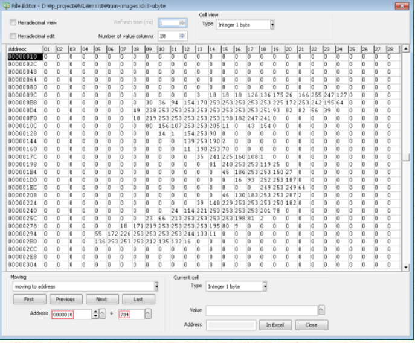

# Tensorflow CNN example

> 이 파일은 Tensorflow에 있는 CNN(Convolutional Neural Network) 예제입니다.
>
> https://www.tensorflow.org/tutorials/images/cnn?hl=ko-KRChoosing&skip_cache=true


```python
# 픽셀의 값을 0~1 사이로 정규화
train_images, test_images = train_images / 255.0, test_images / 255.0

# train_images는 아래와 같이 0~255로 표시 됨.
# 0=흰색, 255=검은색
```



> 출처: acwboy님의 블로그 https://blog.naver.com/acwboy

### models

```python
tf.keras.Model(
    *args, **kwargs
)
```

### layers

```python
Conv2D(
    filters,
    kernel_size,
    strides=(1, 1),
    padding='valid',
    data_format=None,
    dilation_rate=(1, 1),
    activation=None,  # 활성화 함수: sigmoid, tahnh, ReLU, Leakly ReLU, PReLU, ELU
    use_bias=True,
    kernel_initializer='glorot_uniform',
    bias_initializer='zeros',
    kernel_regularizer=None,
    bias_regularizer=None,
    activity_regularizer=None,
    kernel_constraint=None,
    bias_constraint=None,
    **kwargs,
)
# 각 요소별 기능
# https://datascienceschool.net/view-notebook/8fe08ad706984c3c8acaa44b787dcac0/

model.add(layers.MaxPooling2D((2, 2)))
# 2*2 행렬에서 최대값만 적용
```

