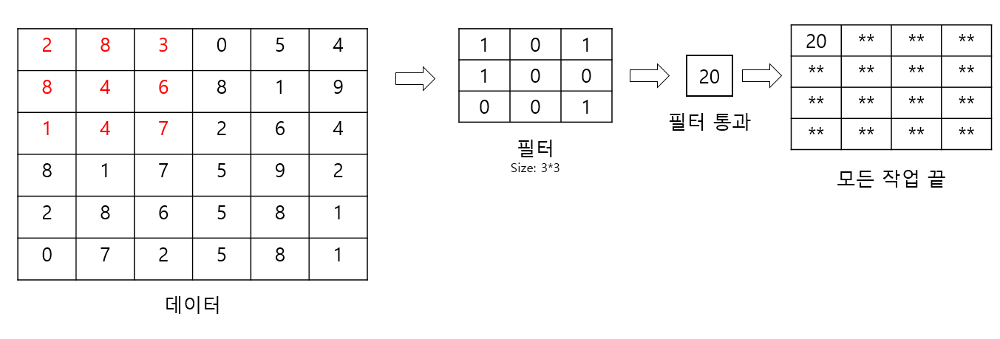
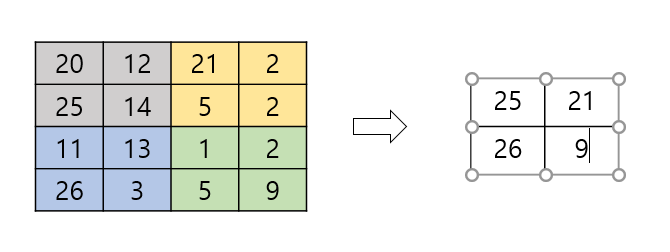
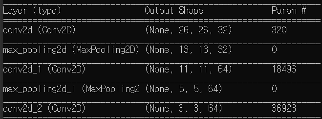

# 0909 학습

### 활성화 함수

- 노드의 입력 값들에 대해 바로 전달하지 않고 비선형 함수를 통과시킨 후 전달 함. 이 때의 비선형함수를 활성화 함수라 한다.

- tensorflow에서는 모델에 각 레이어층을 생성할 때, activate="ReLU"와 같은 형식으로 들어감.

  > 비선형 사용 이유
  >
  > 각 층마다 선형 함수 f(x) = ax라 가정 할 때, 3개층을 통과시 y(x) = f(f(f(x))), y = a^3 * x로 사용하는 의미를 찾기 힘듬.


### 활성화 함수의 종류

1. ReLU 함수 (Rectified Linear Unit)

   f(x) = max(0, x)

   - 최근 가장 많이 사용되는 활성화 함수임.

   - 학습이 빠르고, 연산비용이 작음, 구현이 간단
   - x < 0 영역에서 f`(x) = 0이므로 뉴런이 죽을 수도 있음.

2. Leakly ReLU

   f(x) = max(0.01x, x)

   - ReLU에서 뉴런이 죽는 단점을 해결하기 위해 나온 함수

3. PReLU

   f(x) = max(ax, x)

   - Leakly와 유사하지만 a를 추가하여 x < 0 에서도 기울기 학습이 가능.

4. ELU

   f(x) = x (x > 0), a(e^x - 1) (x >= 0)

   - exp함수를 계산해야 하므로 연산이 ReLU에 비해 복잡함.

5. Maxout 함수

   f(x) = max(w1\*x + b1, w2\*x + b2)

   - ReLU의 장점을 갖고 있으며, 죽는 뉴런이 나오지 않지만 계산량이 복잡함.

6. 그 외에 Sigmoid, tanh가 있지만 큰 효과를 보기 힘들고 오래걸리기 때문에 보통 ReLU 사용을 권장함.


### Layers

1. Conv2D

   ```python
   Conv2D(
       filters,
       kernel_size,
       strides=(1, 1),
       padding='valid',
       data_format=None, # default = channels_last
       dilation_rate=(1, 1),
       activation=None,
       use_bias=True,
       kernel_initializer='glorot_uniform',
       bias_initializer='zeros',
       kernel_regularizer=None,
       bias_regularizer=None,
       activity_regularizer=None,
       kernel_constraint=None,
       bias_constraint=None,
       **kwargs,
   )
   ```

   - filter: 사용할 필터(kernel)의 개수, 문제가 복잡할 수록 많이 필요
   - kernel_size: 필터의 사이즈 (1, 1), (3, 3), (5, 5), (7, 7)이 존재함
   - strides: 필터 사용 후 이동방향 (1, 1)일 경우 좌우 1픽셀, 상하 1픽셀 이동 후 필터 적용
   - padding: 출력크기를 조절 함. valid 출력 크기가 입력크기보다 작음. same 입출력 크기가 같음 => 이미지 처리시 크기가 동일해 시간 오래걸릴 듯?
   - data_format: "channels_last"입력 시 데이터 텐서 형식이 (데이터 수, 높이, 폭, 채널수) "channels_first" (데이터 수, 채널수, 높이, 폭)

   

   > 이렇게 데이터에 필터 값을 곱하기 때문에 합성곱 신경망이라 부르는거 같음.

2. MaxPooling2D

   - MaxPooling2D(n, n)의 범위에서 가장 큰 값을 출력 함.

   

```python
model.add(layers.Conv2D(32, (3, 3), activation='relu', input_shape=(28, 28, 1)))
model.add(layers.MaxPooling2D((2, 2)))
model.add(layers.Conv2D(64, (3, 3), activation='relu'))
model.add(layers.MaxPooling2D((2, 2)))
model.add(layers.Conv2D(64, (3, 3), activation='relu'))

model.summary()
```

3. Flatten()
   - 모든 layer를 통과 후 나온 n차원 배열을 1차원 배열로 변경 => 파일 크기 감소
   - n차원 배열을 1차원 배열로 변경하므로 flatten()이후 lyaer 편집 불가

위와 같은 코드를 실행 할 경우



- 첫 Conv2D layer 통과 이후 kernel_size에 의해 (28, 28) size가 (26, 26)으로 줄어듬

- max_polling2d layer 통과 이후 (26, 26)에서 (2, 2)범위의 max 값 출력으로 인해 절반 (13, 13)으로 줄어듬.

  