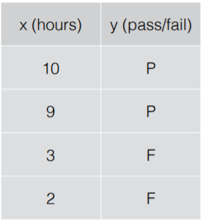
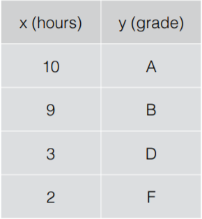
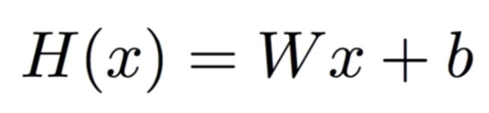
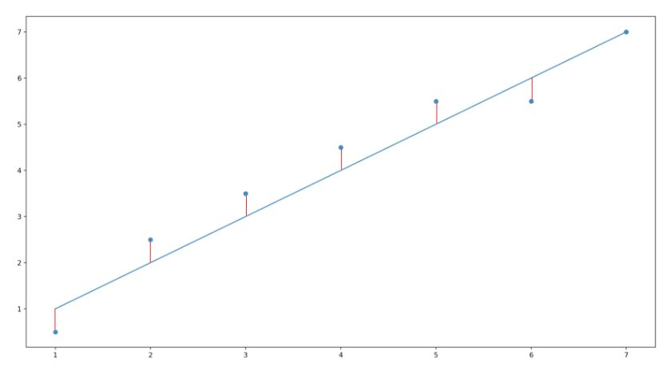
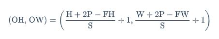
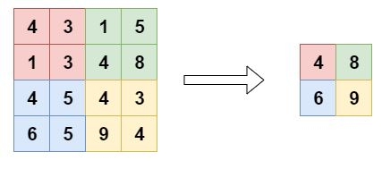
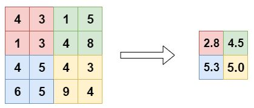

# README

## Machine Learing 이란?

- Limitations of explicit programming

#### 1) Supervised learing

- 정답을 알려주며 학습시키는 것

1-1) 분류(classification)

- 이진 분류

>어떤 데이터에 대해 두 가지 둥 하나로 분류할 수 있는 것

- 다중 분류

>어떤 데이터에 대해 여러 값 중 하나로 분류할 수 있는 것

1-2) 회귀(regression)

>데이터들의 특징을 토대로 값을 예측하는 것

### 2)  Unsupervised learing

- 정답을 따로 알려주지 않고 학습시키는 것

>어떤 데이터들을 비슷한 데이터 끼리 모아 군집화 하는 것
>
>예를 들어 뉴스 그륩핑, 단어 군집화

### 3) Linear Regression (선형 회귀)

>데이터를 가장 잘 대변하는 직선의 방정식을 찾는 것

 ##### Hypothesis

>이 직선의 방정식을 찾기 위해 Hypothesis(가설)을 세운다

>W값과 b값을 찾아내는 것이 선형 회귀의 목적이다

 ##### Cost
 
 >직선이 현재 데이터를 얼마나 잘 표현하는지를 측정하기 위해 Cost function이란 함수를 쓰게 된다.
 
 

 >여기서 실제 데이터의 y 값과 직선이 예측한 y 값의 차이를 이용해 비용을 계산하고
 >
 > 이 비용이 최소가 되는 직선을 찾는 것이 선형 회귀의 목적이다

## CNN(합성곱 신경망)

### 1) Convolution

 
 
>데이터의 특정한 feature를 구하기 위해 인접한 픽셀에 필터를 곱해서 얻어진 값

 1-1) Stride
 
 >필터가 픽셀을 이동하면서 연장할 때 이동하는 간격
>세밀한 조정이 필요할 땐 낮은 값, 반대의 경우에는 높은 값

 1-2) Zero-Padding
 
 >특성 맵의 크기가 작아지는 것(정보손실)을 방지하기 위해 입력 데이터 주면에
>0으로 채운 가상의 테두리를 만들어 합성곱 연산을 수행하는 것

 1-3) 출력 크기 계산
 
 >패딩과 스트라이드를 적용하고, 입력데이터와 필터의 크기가 주어졌을 때 출력 데이터의 크기를 구할 수 있다.

 

- (H, W): 입력 크기 (input size)

- (FH, FW) : 필터 크기 (filter/kernel size)

- S : 스트라이드 (stride)

- P : 패딩 (padding)

- (OH, OW) : 출력 크기 (output size)

### 2) Pooling layer

>Convoltion과 다르게 필터의 매개변수는 필요하지 않다
>대상 영역의 최대값이나 평균으로 계산한다.

 2-1) Max Pooling
 
 
 
 >각 영역의 최대값을 출력으로 나타낸다
 
 2-2) Average Pooling
 
  
  
  >각 영역의 평균값을 구해 출력으로 나타낸다

 
### 3) Fully-connected layer

## RNN(순환 신경망)

### 1) 순환 뉴런

>CNN과 다르게 RNN은 출력이 다시 입력으로 받는 부분이 있다
>

### Tensorflow

- 텐서플로우 문서 한글 번역본 https://tensorflowkorea.gitbooks.io/tensorflow-kr/content/g3doc/
