# 얼굴 데이터 학습 _눈썹

### 분류 : 숱 / 모양

### 1. 숱

- 짙은눈썹 : 이성 상대를 단지 "놀이" 상대로 보지 않는 성실한 타입. 부모님을 돌보면서 어려운 일을 도받아 해나가야 할 운명

  (여) 통솔력이 좋고 믿음직함. 의리가 좋아 친구들을 잘 대하는 편. 재운과 명예운이 좋아 성공 가능성이 높음

- 숱이없는 눈썹

  : 눈썹 숱이 없는 경우는 인복도 없다고 볼수 있습니다. 하지만 눈썹을 그리거나 간단한 시술을 통해 자연스럽게 눈썹을 진하게 만든다면 인상도 바꿀수 있습니다.

  출처 : 잡포스트(JOBPOST)(http://www.job-post.co.kr)

### 2. 모양

#### (1) 방향

- 위를 향한 눈썹 

  (남) 스태미너가 왕성하고 피로를 모름. 매사 분명하고 확실한 성격, 결혼 후 원만한 가정을 꾸림

  (여) 예술에 소질이 있으며 유행에 민감하다. 맡은 일에 최선을 다하는 편. 욕심이 많고 성격도 급하며 예민하다. 남의 눈과 평가에 민감하게 반응한다

- 치켜 올라간 눈썹 : 개성이 강하며 경쟁을 즐김. 승부욕이 강해 라이벌이 있으면 더 열심히 한다. 집중력과 추진력도 뛰어남

- 아래로 내려간 눈썹

  (남) 자신의 의견을 확실히 말하는 성격. 자신의 의견이 받아질 때까지 끝까지 노력하는 강한 성격의 소유자

  (여) 배려심이 좋고 상냥하며 여유로운 성격이다. 남에게 의지하지 않고 주도적으로 일을 처리한다. 의지가 강하고 누구에게나 사랑받는 타입

#### (2) 길이

> 눈 길이에 따라 상대적
>
> 보통 길이 = 눈 길이+좌우0.5cm (이보다 짧으면 짧은눈썹, 길면 긴눈썹)

- 짧은 눈썹

  - 여성 : 내조하는 스타일
  - 남성 : 밖으로 드러나는 성격은 급하지만 내면은 부드러운 사람

- 긴 눈썹 : 어른스럽고 보수적인 성격의 소유자. 무엇인가를 연구하는 학자 스타일

#### (3) 모양

- 아치형 눈썹

  (남) 매우 사교적이며 주변사람들을 끌어들이는 매력의 소유자. 크게 노력하지 않아도 존재감이 있음

  (여) 온화하며 감수성이 풍부하고 이해심이 좋다. 성실하고 근면하다

- S자형 눈썹

  (남) 자신감 넘치고 호쾌한 성격으로 성공할 가능성이 크다. 사리분별이 명확하며 티나는 거짓말을 싫어함

- 둥근눈썹

  (남) 공정하고 논리적. 주변사람에게 책임을 묻지 않고, 감정에 쉽게 휩쓸리지 않는다

- 일자눈썹

  (남) 당당하고 지혜로우며 신속하게 문제를 해결함. 고집은 조금세지만 목표를 이루므로 신뢰가 높음

  (여) 솔직하고 결단력이 있으며 규칙적인걸 좋아함. 자기중심적이며 단순한 편

- 처진눈썹

  (남) 부드럽고 젠틀한 성격으로 친구를 빨리 만듦. 감정 이입을 잘해 다른사람의 문제해결에도 잘 나선다

- 두꺼운 눈썹

  (여) 남성적이고 자기중심적. 심지가 굳은 편이지만 너무 두꺼우면 공격적일수 있음

- 얇은 눈썹

  (여) 순수하고 섬세하며 배려심이 좋지만, 너무 가늘면 신경이 날카로울 수 있음. 소극적이고 보수적이며 주위에 휘둘릴 수 있다.

  

#### (4) 기타

- 점, 사마귀가 있는 눈썹 : 30세에 인생의 커다란 전환점이 생긴다. 일에는 성공수가 있지만 가족의 도움을 받거나 혜택 입을 일은 없다
- 중간에 잘린 눈썹 : 직감력이 뛰어나고, 아이디어 발생이 뛰어남. 하지만 인내력이 없어 일을 끝까지 잘 못 해내는 편 (남)
- 좌우가 이어진 눈썹 : 결단력이 있고 강한 의지의 소유자. 사회적인 성취욕이 강해 결혼 후 가정에는 소홀하기 쉬움

\* 참고자료

-  https://m.blog.naver.com/sajuboa/220751021037
- https://amazon-young.tistory.com/4 (다른부위도 있음)

\* 참고 이미지

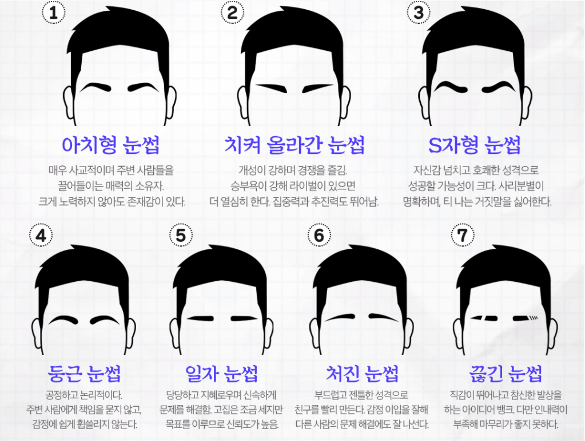

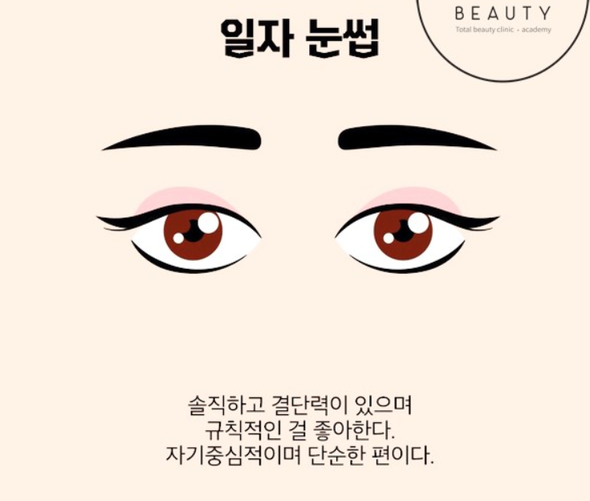

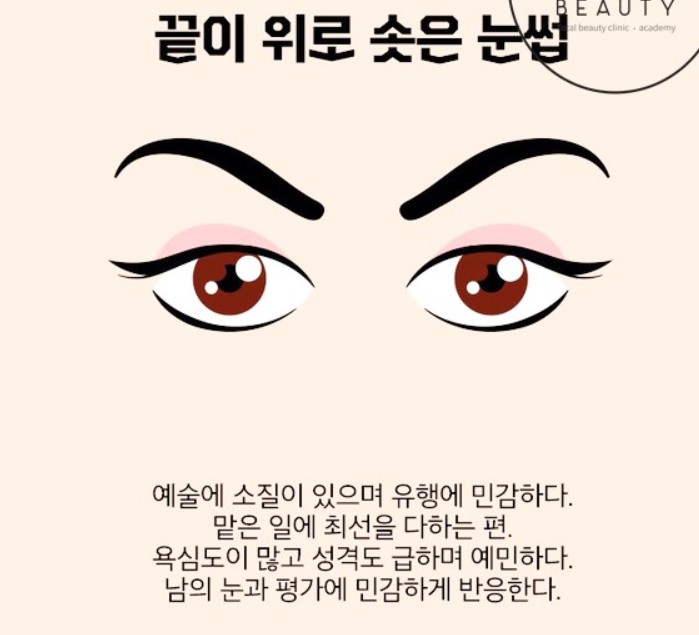

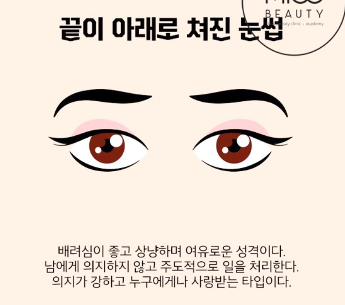

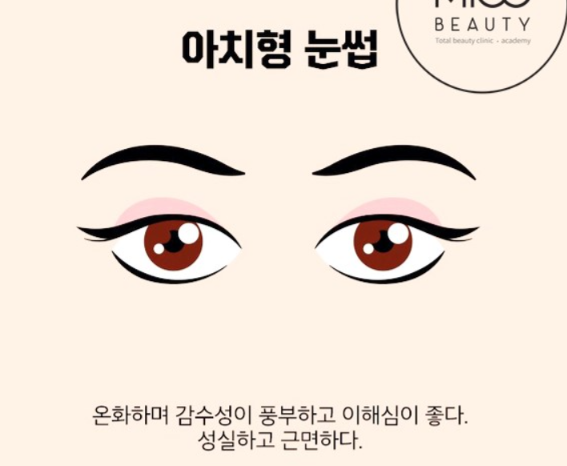

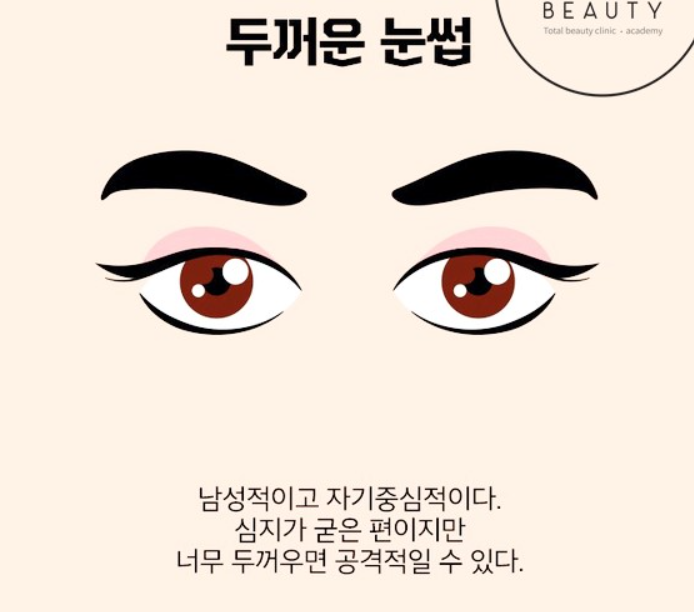

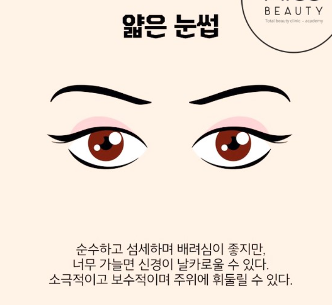

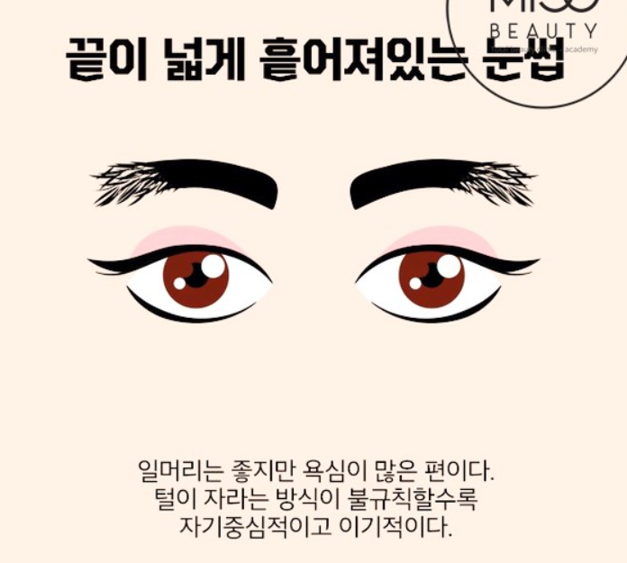

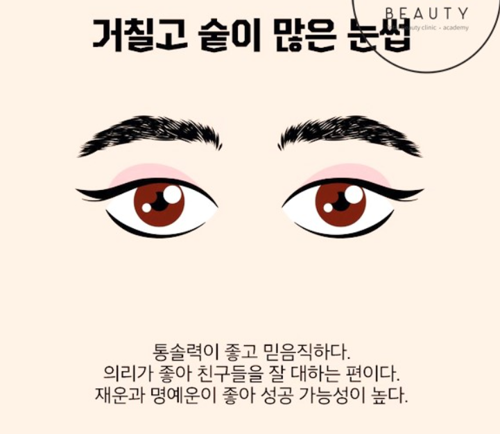

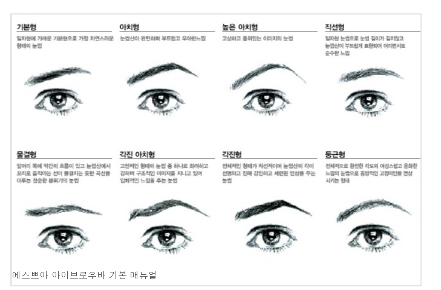

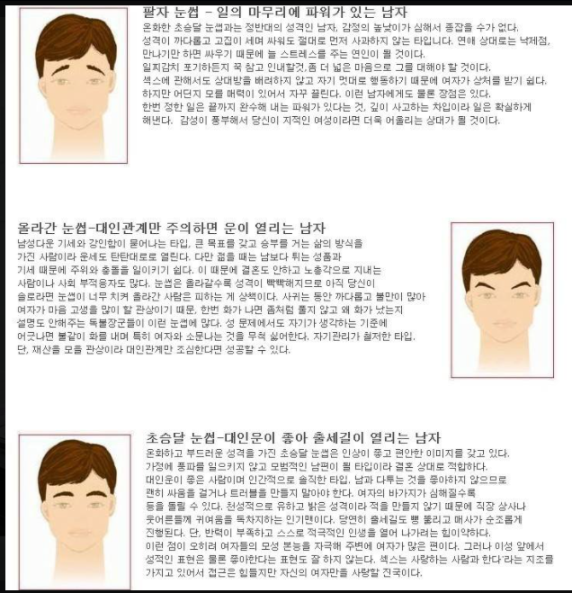

