> sub2 명세 및 학습내용 요약본

# Sub2

## CNN / RNN 학습 => 이미지 캡셔닝 모델 구현

### <1> 프로젝트 개요

Sub PJT 1 에서 학습한 인공신경망을 확장시켜 이미지 데이터에 적합한 컨볼루션 신경망과 순서가 있는 데이터에 적합한 순환 신경망에 대해 학습하고 이 두 신경망을 합쳐 이미지 캡셔닝 모델을 구현

- CNN (Convolutional Neural Networks) : 컨볼루션 신경망 => 이미지에서 물체의 형태를 인지하거나 색깔을 구별하는 등 특성을 뽑아냄

- RNN (Recurrent Neural Networks) : 순환 신경망 => 뽑아낸 특성을 바탕으로 문장을 생성

- 이미지 캡셔닝 : 이미지를 묘사하는 문장을 생성하는 것을 의미

  => 이미지가 입력으로 들어오면 이미지 모델로 먼저 특성을 뽑아내고, 그것을 텍스트 모델에 전달하여 이미지를 묘사하는 텍스트를 생성


### <2> 프로젝트 목표

1. 컨볼루션 인공 신경망(CNN)에 대한 이해

2. 순환 신경망(RNN)에 대한 이해

3. 이미지 캡셔닝 모델에 대한 이해

4. 데이터셋 분할과 성능 최적화에 대한 이해

5. 팀별 서비스 기획, 데이터셋 검색 및 모델 선정


### <3> 필수 지식 학습

#### 1. 이미지 처리

(1) CNN

① 기본 연산들

> 컨볼루션 신경망에 사용되는 다양한 연산들에 대한 설명
>
> https://excelsior-cjh.tistory.com/180

- 합성곱층(Convolutional Layer) : 입력 데이터의 형상 유지. => 이미지 데이터처럼 형상을 가지는 데이터를 제대로 학습할 가능성이 높음

- 필터 : 합성곱층에서의 수용영역.

- CNN의 합성곱층은 "교차상관"을 사용 (텐서플로우 등)

- 텐서플로우에서의 **합성곱층**

  : 텐서플로에서 각 입력이미지는 `[높이, 너비, 채널] = [H, W, CH]`형태의 3D 텐서([Tensor](http://excelsior-cjh.tistory.com/148?category=940399))로 표현되며, 미니배치(mini-batch)는 `[batch, H, W, CH]` 형태의 4D 텐서로 표현됨

  <텐서플로에서 합성곱층을 구현할 수 있는 함수>

  📌 `tf.nn.conv2d()`

  - 인자값

    ```python
    tf.nn.conv2d(
       input,
       filter, # 사용자가 직접 [FH, FW, In_CH, Out_CH] 형태의 4D 텐서로 만들어 주어야 함
       strides,
       padding, # same 혹은 valid로 설정할 수 있음
       use_cudnn_on_gpu=True,
       data_format='NHWC', # 채널의 위치를 앞에다 할 것인지, 뒤에다가 할 것인지 / 디폴트는 NHWC, 채널을 앞으로 하고 싶은 경우 NCHW로 변경
       dilations=[1, 1, 1, 1],
       name=None
    )
    ```

  - 예시

    ```python
    filter = tf.get_variable(name='W1', shape=[3, 3, 1, 32],  # [FH, FW, in_ch, out_ch]
                            initializer=tf.contrib.layers.xavier_initializer_conv2d())
    conv = tf.nn.conv2d(inputs, filter, strides=[1, 1, 1, 1], padding='SAME')
    ```

    

  📌 `tf.layers.conv2d()`

  - 인자값

    ```python
    tf.layers.conv2d(
       inputs,
       filters, # 필터를 간단하게 만들어 바로 합성곱층을 구현할 수 있음
       kernel_size,
       strides=(1, 1),
       padding='valid',
       data_format='channels_last',
       dilation_rate=(1, 1),
       activation=None,
       use_bias=True,
       kernel_initializer=None,
       bias_initializer=tf.zeros_initializer(),
       kernel_regularizer=None,
       bias_regularizer=None,
       activity_regularizer=None,
       kernel_constraint=None,
       bias_constraint=None,
       trainable=True,
       name=None,
       reuse=None
    )
    ```

  - 예시

    ```python
    conv = tf.layers.conv2d(inputs, filters=32, kernel_size=3,  # or kernel_size=[3, 3]
                           padding='SAME')
    ```

    

- 텐서플로에서의 풀링층

  > 풀링층 : 차례로 처리되는 데이터의 크기를 줄임 (모델 전체 매개변수의 수를 크게 줄임)
  >
  > - Max-pooling : 해당 영역에서 최대값 ✔ 이미지 인식 분야에서 주로 사용
  > - Average pooling : 해당영역의 평균값을 계산

  < Max-Pooling 구현 방법>

  📌 `tf.nn.max_pool()` 

  - 인자값

    ```python
    tf.nn.max_pool(
       value,
       ksize,	# 풀링크기를 지정, [batch, H, W, C] 형태로 풀링 크기 지정
       strides,
       padding,
       data_format='NHWC',
       name=None
    )
    ```

  - 예시

    ```python
    tf.nn.max_pool(inputs, ksize=[1, 2, 2, 1], strides=[1, 2, 2, 1], padding='SAME')
    ```

    

  📌 `tf.layers.max_pooling2d()` 

  - 인자값

    ```python
    tf.layers.max_pooling2d(
       inputs,
       pool_size,
       strides,
       padding='valid',
       data_format='channels_last',
       name=None
    )
    ```

  - 예시

    ```python
    tf.layers.max_pooling2d(inputs, pool_size=[2, 2], strides=[2, 2], padding='same')
    ```

    

② 강의 및 TF 예시 코드

> 컨볼루션 연산에 대한 설명과 이를 텐서플로우로 구현하는 방법
>
> https://www.youtube.com/watch?v=9fldE3-yJpg&list=PLQ28Nx3M4Jrguyuwg4xe9d9t2XE639e5C&index=34
>
> - 실습코드 : https://github.com/deeplearningzerotoall/TensorFlow


- 3가지 레이어

  - convolution layer, pooling layer (앞) : feature extraction
  - fully-connected layer : classfication => 실제 판단하는 레이어

- Convolution Layer

  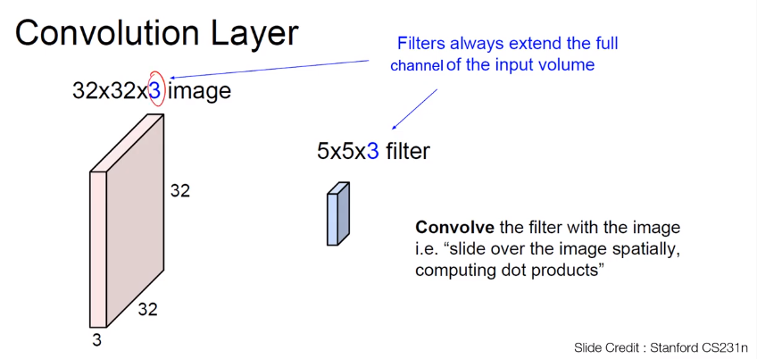

  - 채널 : 3인경우 RGB
  - 컨볼루션으로 입력으로 들어오는 채널과 필터의 채널과 같아야 한다 !!

  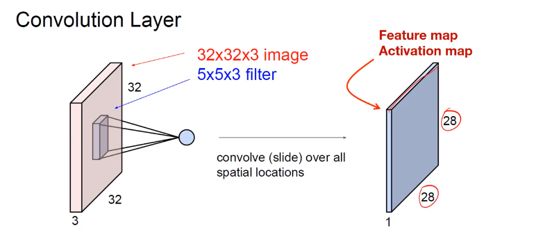

  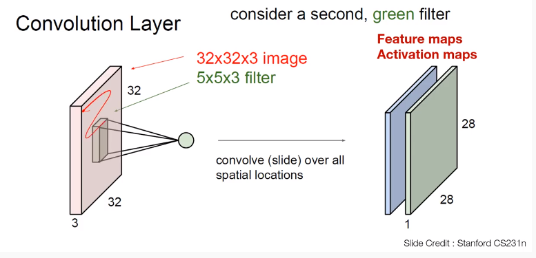

  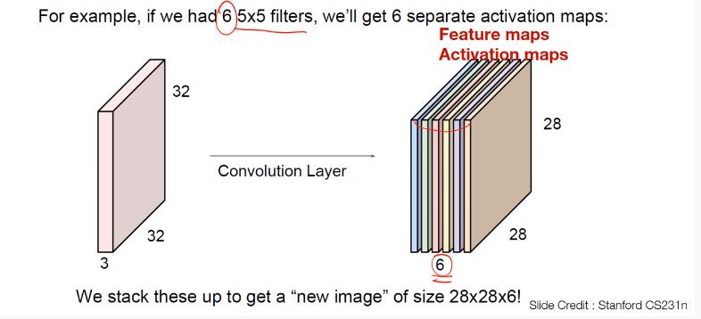

  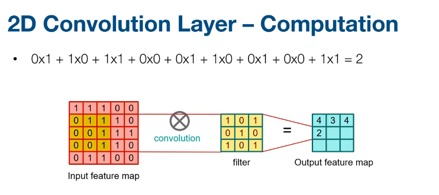


📌 tf.keras.layer.Conv2D


- filters : convolution 필터의 수
- kernel_size : 필터의 사이즈 (ex, 3, [3,3])
- stride
- padding
  - valid : padding 안하는 것
  - same : 입력과 출력의 사이즈가 같아지도록 하는 것
- date_format
  - channels_last(dafault) : [batch, height, width, channels]
  - channels_first : [batch, caheenls, height, width]


③ 강의 및 PyTorch 예시 코드

> 컨볼루션 연산에 대한 설명과 이를 파이토치로 구현하는 방법
>
> https://www.youtube.com/watch?v=rySyghVxo6U&list=PLQ28Nx3M4JrhkqBVIXg-i5_CVVoS1UzAv&index=19


(2) CNN 모델

① 주요 모델들

> 이미지넷 대회에 나온 다양한 모델들
>
> https://www.sallys.space/blog/2018/01/26/cnn-imagenet/

**📌 VGG16, 19**

: 각 16, 19 개의 레이어를 가지고 있는 모델

- Conv, Pooling, FC layer로만 이루어져 있기 때문에 코딩하기가 비교적 쉬움
- small filter, Deeper networks
- 단점 : 학습이 매우 느림, 용량이 엄청나게 큼 (이유 : 파라미터가 많음)


**📌 Inception V3** : multi level feature extracting 을 하는 모듈


**📌 ResNet**

- 레이어 수를 늘려서 depth를 깊게..


② 이미지넷 챌린지 및 발전과정

> 이미지넷 대회에 나온 모델들이 발전해 온 과정
>
> https://github.com/GunhoChoi/PyTorch-FastCampus/blob/master/04_CNN_Advanced/CNN_Advanced.pdf

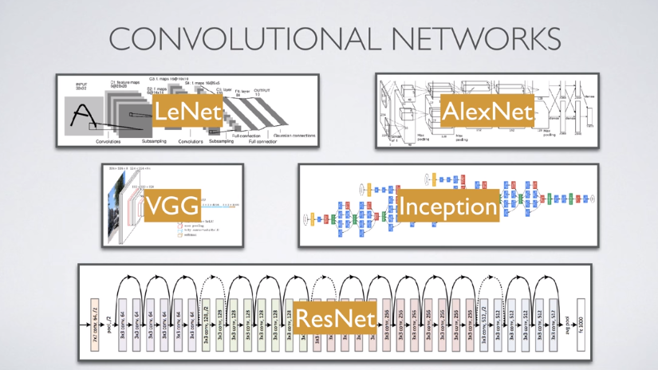

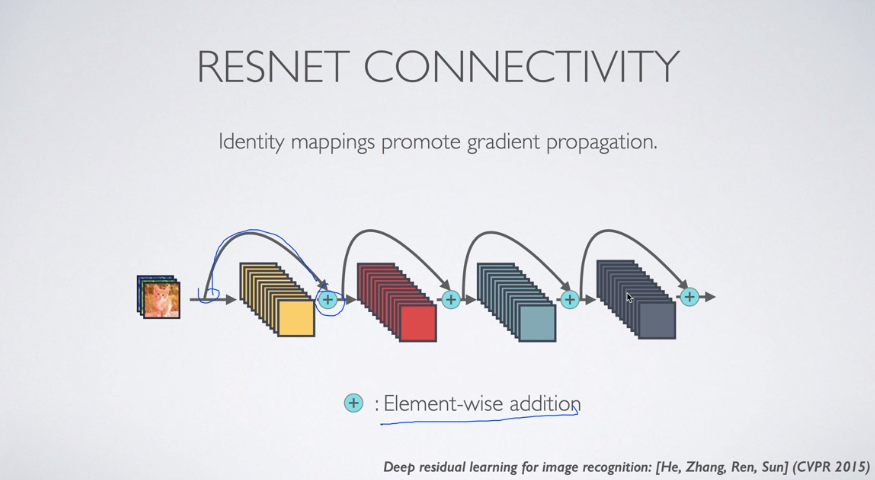


③ DenseNet

> 덴스넷 모델에 대한 설명
>
> https://www.youtube.com/watch?v=fe2Vn0mwALI

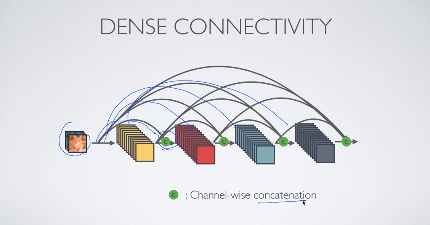

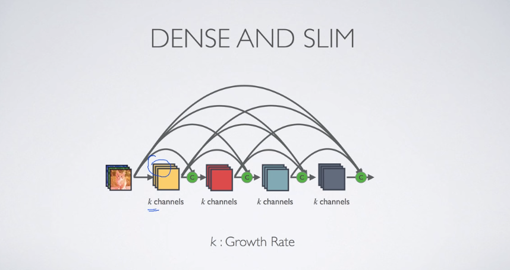

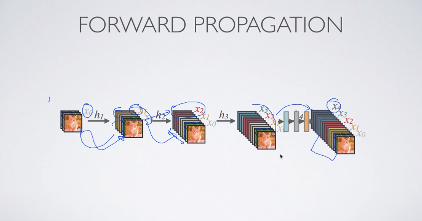


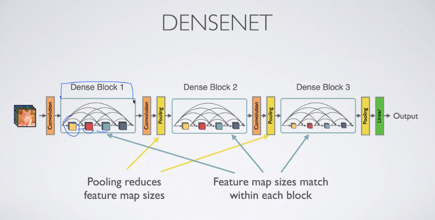


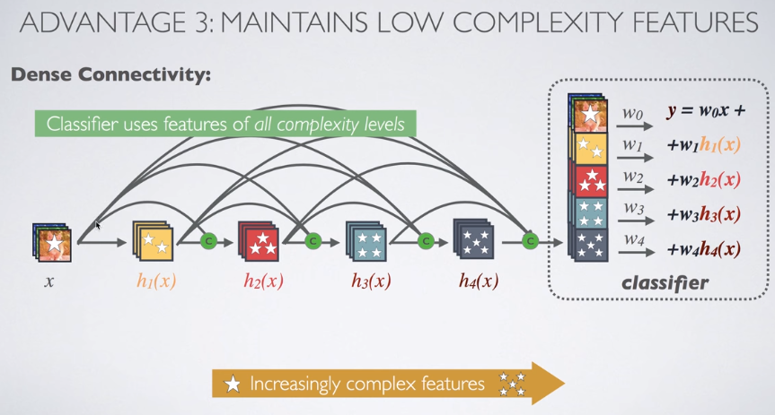

- 장점 : 학습이 잘 됨 / 버리는 것 없이 사용 => 효율적


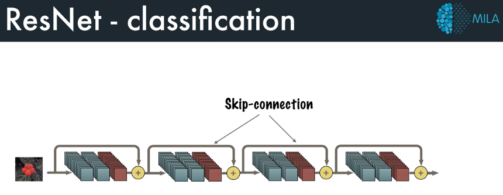

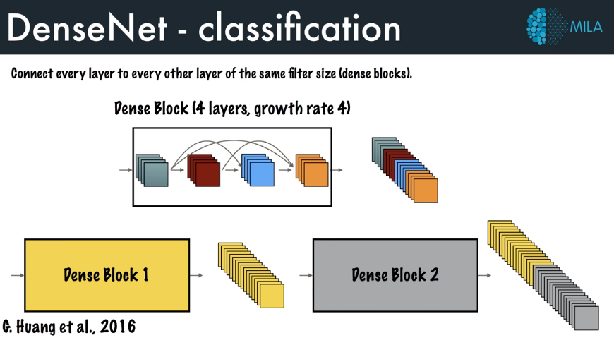

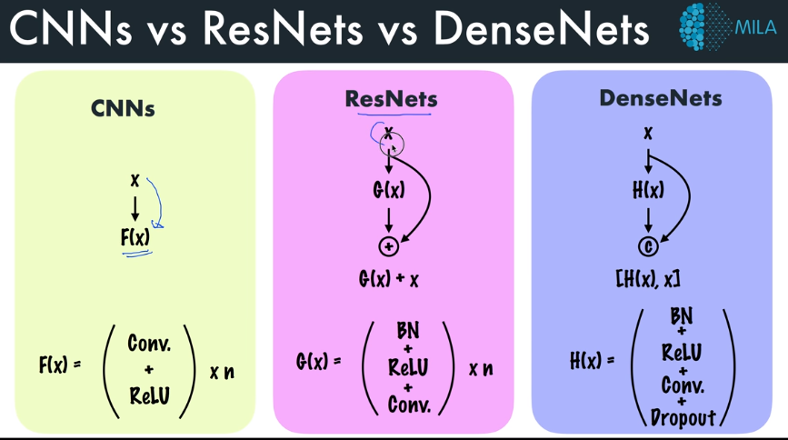

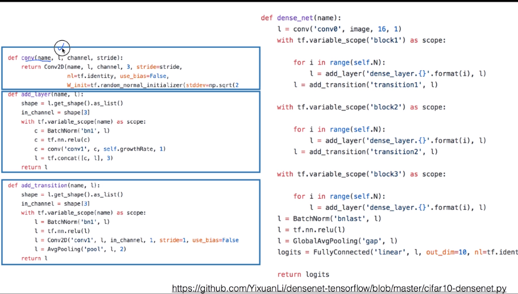


#### 2. 자연어 처리

(1) NLP

① 토큰화

> 토큰화에 대한 설명
>
> https://wikidocs.net/21698

- 단어 토큰화

  - <u>**📌 NLTK** : **영어 코퍼스를 토큰화하기 위한 도구들을 제공**</u>

    - **word_tokenize**는 Don't를 Do와 n't로 분리하였으며, 반면 Jone's는 Jone과 's로 분리

    - **WordPunctTokenizer**는 <u>구두점을 별도로 분류하는 특징</u>을 갖고 있음

      Don't를 Don과 '와 t로 분리하였으며, 이와 마찬가지로 Jone's를 Jone과 '와 s로 분리

  - **📌케라스 :  **<u>text_to_word_sequence</u>를 지원

    - **text_to_word_sequence**는 기본적으로 <u>모든 알파벳을 소문자로 바꾸면서 온점이나 컴마, 느낌표 등의 구두점을 제거</u>. 그러나 don't나 jone's와 같은 경우 아포스트로피는 보존

  - 📌**<u>Penn Treebank Tokenization의 규칙</u>**

    규칙 1. 하이푼으로 구성된 단어는 하나로 유지.
    규칙 2. doesn't와 같이 아포스트로피로 '접어'가 함께하는 단어는 분리.

- 문장 토큰화

  - **📌 NLTK에서는 영어 문장의 토큰화를 수행하는 sent_tokenize**

  - 📌 **KSS : 한국어에 대한 문장 토큰화 도구**

  - 이진분류기(Binary Classifier)

    > 문장 토큰화에서 예외 사항을 발생시키는 온점의 처리를 위해서 입력에 따라 두 개의 클래스로 분류하는 것
    >
    > 두 개의 클래스 : 온점이 약어(abbreivation)로 쓰이는 경우 / 온점(.)이 정말로 문장의 구분자(boundary)일 경우

    📌 관련 오픈 소스 : NLTK, OpenNLP, 스탠포드 CoreNLP, splitta, LingPipe 등

- 품사 태깅 (Part-of-speech tagging)

  - NLTK : 영어 코퍼스에 품사 태깅 기능을 지원

    NLTK에서는 Penn Treebank POS Tags라는 기준을 사용

  -  KoNLPy("코엔엘파이"라고 읽습니다) : 한국어 코퍼스에서 품사 태깅 기능 지원

    Okt(Open Korea Text), 메캅(Mecab), 코모란(Komoran), 한나눔(Hannanum), 꼬꼬마(Kkma)

    -  Okt 형태소 분석기

      1) morphs : 형태소 추출
      2) pos : 품사 태깅(Part-of-speech tagging)
      3) nouns : 명사 추출

    - 꼬꼬마 형태소 분석기

    


② 정수 인코딩

> 케라스의 텍스트 전처리 https://wikidocs.net/31766

: 텍스트를 숫자로 바꾸는 기법 (컴퓨터는 숫자를 더 잘 처리하기 때문)

📌 **단어를 빈도수 순으로 정렬한 단어 집합(vocabulary)을 만들고, 빈도수가 높은 순서대로 차례로 낮은 숫자부터 정수를 부여하는 방법**

>  이 방법보다 Counter, FreqDist, enumerate 또는 케라스 토크나이저를 사용하는 것을 권장


📌 **Counter**

: 단어 집합을 하나의 리스트로 만든 후 `Counter()` 사용하여 종복을 제거하고 단어의 빈도수를 기록

- most_common()는 상위 빈도수를 가진 주어진 수의 단어만을 리턴


📌 **NLTK의 FreqDist**

: FreqDist() - 빈도수 계산 도구


📌 **enumerate()**

: 순서가 있는 자료형(list, set, tuple, dictionary, string)을 입력으로 받아 인덱스를 순차적으로 함께 리턴하는 특징


📌  **케라스(Keras)의 텍스트 전처리**

: 기본적인 전처리를 위한 도구들을 제공

- fit_on_texts : 입력한 텍스트로부터 단어 빈도수가 높은 순으로 낮은 정수 인덱스를 부여
- word_index : 각 단어에 인덱스가 어떻게 부여되었는지를 보여줌 (실제 적용은 texts_to_sequences를 사용할 때 적용)
- word_counts : 각 단어가 카운트를 수행하였을 때 몇 개였는지를 보여줌 (실제 적용은 texts_to_sequences를 사용할 때 적용)
- texts_to_sequences() : 입력으로 들어온 코퍼스에 대해서 각 단어를 이미 정해진 인덱스로 변환
- tokenizer = Tokenizer(num_words=숫자) : 빈도수가 높은 상위 몇 개의 단어만 사용하겠다고 지정할 수 있음


③ 임베딩

> 정수 인코딩 된 벡터를 임베딩 하는 방법 https://subinium.github.io/Keras-6-1/

📌 원-핫 인코딩 (케라스 사용)

: 단어 별로 인덱스를 부여하고 이 정수 인덱스 i를 크기가 N(어휘 사전 크기)인 이진 벡터로 변환. i번째 원소만 1이고 나머지는 모두 0.


📌 원-핫 해싱 one-hot-hashging

: 어휘 사전에 있는 고유 토큰 수가 너무 커서 모두 다루기 어려울 때 사용


**<u>📌 단어 임베딩</u>**

: 원-핫 인코딩에 비해 더 많은 정보를 더 적은 자원에 저장함

- 관심 대상인 문제와 함께 단어 임베딩을 학습

  : 이런 경우 랜덤한 단어 벡터로 시작해서 신경망의 가중치를 학습하는 것과 같은 방식으로 단어 벡터를 학습

-  **사전 훈련된 단어 임베딩(pretrained word embedding)** : 풀려는 문제가 아니고 다른 머신 러닝 작업에서 미리 계산된 단어 임베딩을 로드


📌Embedding 층을 사용하여 단어 임베딩 학습

- 단어 임베딩 : 언어를 기하학적 공간에 매핑하는 것

  예) ‘king’ + ‘female’ => ‘queen’

  => BUT ! 사람의 언어를 완벽하게 매핑해서 이상적인 단어 임베딩 공간을 만들기는 어려움

  => 따라서 ! 각 언어와 상황에 따라 임베딩 공간을 학습하는 것이 타당함

  📌  `Embedding` 층 학습방법 : 역전파 + 케라스

  `from keras.layers import Embedding` 

  - `Embedding` 층은 크기가 `(samples, sequences_length)`인 2D 정수 텐서를 입력으로 받음.

    각 샘플은 정수의 시퀀스

    가변 길이의 경우, 제로패딩 또는 자름으로 크기를 맞츔.

    `Embedding` 층은 크기가 `(samples, sequences_length, embedding_dimensionality)`인 3D 정수 텐서를 반환

    3D 텐서는 RNN 층이나 1D 합성곱 층에서 처리됨


(2) RNN

① 순환 신경망 기초

> 순환신경망에 대한 기본적인 설명과 예시 코드 https://excelsior-cjh.tistory.com/183?category=940400

- RNN : RNN은 입력(x)을 받아 출력(y)를 만들고, 이 출력을 다시 입력으로 받음

  📌 `Vector-to-Sequence` : 첫 번째 타임 스텝에서 하나의 입력만(다른 모든 타임 스텝에서는 0)을 입력받아 시퀀스를 출력하는 네트워크, **Image Captioning**에 사용

  📌 `Sequence-to-Vector` : `Vector-to-Sequence`와는 반대로 입력으로 시퀀스를 받아 하나의 벡터를 출력하는 네트워크, Sentiment Classification에 사용

  📌 `Sequence-to-Sequence` : 시퀀스를 입력받아 시퀀스를 출력하는 네트워크, 주식가격과 같은 시계열 데이터를 예측하는 데 사용

  📌`Delayed Sequence-to-Sequence` : **인코더**(encoder)에는 seq-to-vec 네트워크를 **디코더**(decoder)에는 vec-to-seq 네트워크를 연결한 것으로, 기계 번역에 사용


② LSTM & GRU

> 기본 RNN을 개선한 LSTM과 GRU에 대한 설명 https://datascienceschool.net/view-notebook/770f59f6f7cc40c8b6dc98dddd06c6c5/
>

- LSTM : 멀리 떨어져 있는 정보 또한 활용하도록 학습할 수 있도록 고안된 것

- LSTM 연산 과정

  1. 망각게이트

     : t시점에서의 입력값(xt)과 이전 t−1시점에서의 출력값(ht−1)을 입력받아 이전 셀의 정보를 망각할지 말지 결정

     : 0에 다가갈수록 이전의 정보를 잊고 1에 다가갈수록 이전의 정보를 기억하도록

  2. 입력게이트

     :  t시점에서의 입력값(xt)과 이전 t−1시점에서의 출력값(ht−1)을 입력받고 현재의 정보를 다음 시점으로 전해질 cell state에 얼마나 반영할 지를 결정

  3. Cell state 갱신

     : 입력값(xt)과 이전 t−1시점에서의 출력값(ht−1)을 입력받고 하이퍼탄젠트 함수를 사용해 Ct를 생성하고 입력게이트의 출력과 Hadamard 곱(⊙)을 한다. 그리고 이 값과 망각게이트의 출력을 이용해 cell state 를 갱신

  4. 현재 셀의 출력값 계산


#### 3. 이미지 캡셔닝 프로젝트 아키텍쳐

#### (1) 기본 아키텍쳐

> 📌 train.py와 predict.py에서 사용되는 설정값들, 전처리 함수, 데이터, 모델, 유틸리티 등은 별도의 폴더를 만들어 관리할 것을 권장

**① Dataset**

- Image data
- Caption data (.csv)

**② train.py : 이미지와 캡션 데이터를 받아 모델을 학습**

> 1) 모델은 이미지를 입력으로 받아
>
> 2) CNN 모델을 통해 이미지의 특징을 추출
>
> 3) 추출된 특징은 RNN 모델로 전달됨
>
> 4) RNN 모델은 여기에 추가로 토큰화 된 캡션 데이터의 일부를 입력 받음
>
> => RNN 모델은 CNN 모델을 통해 추출한 이미지의 특성과 캡션 벡터 이렇게 2가지를 입력으로 받아 학습됨

- Pre-processing

  Image Data Preprocess & Caption Data Preprocess

- Training

  CNN Encoder & RNN Decoder

**③ Trained parameters**

- checkpoints/

**④ Test Data**

- Image data

- Trained parameters

  `checkpoints/`

**⑤ predict.py : 테스트 이미지를 받아 캡션을 예측**

- CNN Encoder & RNN Decoder

**⑥ Output**

- Real caption

  a girl in a white top is sitting by the pool

- Predicted caption

  a woman with a swimsuit


#### (2) 프로젝트 구조

① 전처리 과정 (Preprocessing)

: 모델에 적합하게 데이터를 가공하는 것

- 한 번만 시행해도 되는 부분

  : 캡션 데이터의 토큰화 / 전체 데이터셋 분할

  - datasets 폴더

    - 이미지들이 들어있는 폴더

    - 캡션들이 저장된 CSV 파일

      : image_name (실제 이미지 파일의 이름) / comment_number (이미지 별 캡션의 번호) / comment (캡션)

      => CSV 파일을 토대로 실제 이미지 경로와 이미지에 해당하는 토큰화 된 캡션을 묶고, 전체 데이터를 학습용 데이터 및 테스트용 데이터로 분할해 저장

      => 어떤 단어가 토큰에 해당하는지 맵핑된 정보를 기록해놓은 토크나이져 저장

- 매번 시행해야 하는 부분

  : 불러온 데이터의 순서를 랜덤하게 섞는 과정 / 배치 사이즈에 맞게 분할해 묶는 과정

  - datasets 폴더

    학습하는지 또는 테스트를 진행하는지에 따라 다른 데이터셋을 불러오고, 전처리 part1에서 생성된 토크나이져를 불러오는 과정 포함

    불러온 데이터셋에는 이미지 경로와 토큰화 된 캡션이 있기 때문에 실제 이미지 데이터와 토큰화 된 캡션을 바인딩해 텐서플로우 Dataset 으로 만들게 됨

    텐서플로우 Dataset을 만드는 과정에서 데이터에 랜덤성을 추가하기 위해 데이터의 순서를 바꾸기도 하고, 이미지 데이터의 경우는 랜덤한 확률로 이미지를 뒤집는다던가 하는 Augmentation을 많이 사용하기 때문에 위의 전처리들은 매번 진행하게 됨

    테스트 시에는 순서 바꾸기와 Augmentation이 들어가지 않도록 구현


② 학습과정

- 전처리 과정을 통해 전달된 tf.data.Dataset에는 Encoder의 입력되는 이미지 데이터 또는 미리 뽑힌 특성 벡터가 들어있으며, 토큰화된 캡션도 상으로 들어있음
- 이미지 데이터 또는 미리 뽑힌 특성 벡터는 Encoder에 들어가 Decoder의 입력 형식에 맞게 변환되어 나오며, Encoder 내부는 인공신경망을 통해 입력을 출력으로 변환시킴
- 세부적인 구현은 CNN에 대해 학습하는 과정에서 배울 수 있음
- Encoder의 결과값은 Decoder로 전달되며 이와 동시에 \<start> 토큰의 인덱스가 Decoder로 전달됨
- 그렇게 되면 Decoder는 순차적으로 이미지를 묘사하는 문장의 단어들을 생성함
- 이 때 단어들은 토큰의 가지 수만큼의 길이를 가지는 벡터로 나오게 됨
- 이 결과값을 정답 캡션과 비교해 손실을 계산하고 이 손실을 기반으로 모델의 변수들을 학습하여 최적화가 진행되게 됨
- 모델 내부의 동작, 손실 계산 및 최적화 과정은 제공된 학습자료 및 검색을 통해서 학습하기


③ 테스트 과정

- 모델이 학습되고 나면 체크포인트 매니져를 이용해 학습된 Encoder 와 Decoder의 변수들을 불러와 테스트 이미지에 대한 예측 캡션을 생성할 수 있음
- 이미지 데이터가 전달되어 캡션이 생성되는 과정까지는 학습과 동일하지만 결과 문장을 사람이 해석할 수 있게 바꿔주는 과정이 추가로 진행됨


### <4> 기능 명세

| Req. | Category                         |
| :--: | -------------------------------- |
|  1   | 이미지 데이터 전처리             |
|  2   | 텍스트 데이터 전처리             |
|  3   | Dataset 생성                     |
|  4   | 이미지 모델 (Encoder) 구현       |
|  5   | 텍스트 모델 (Decoder) 구현       |
|  6   | train.py 구현                    |
|  7   | predict.py 구현                  |
|  8   | 체크포인트 매니져 활용           |
|  9   | 팀별 인공지능 서비스 기획안 작성 |


#### 1. 이미지 데이터 전처리

   **1-1. 이미지 파일 로드**

   - 이미지 파일 경로를 입력으로 받아 실제 이미지 데이터를 리턴하는 함수를 구현
   - 이미지 별로 크기가 다른 경우에는 모두 이미지 데이터를 같은 사이즈로 변형

   **1-2. 이미지 정규화**

   - 전체 이미지 데이터의 RGB 값의 평균과 분산을 구해 데이터를 정규화 하는 함수를 구현
   - 해당 함수를 이미지 1-1 기능과 합쳐 이미지 파일을 로드할 때 정규화 여부가 전달되고 이에 맞춰 정규화 된 데이터 또는 정규화 되지 않은 데이터를 읽어오도록 함

   

#### 2. 텍스트 데이터 전처리

   **2-1. 텍스트 데이터 토큰화**

   - 텍스트 상태인 데이터를 텐서플로우 Tokenizer 를 이용해 각 단어에 해당하는 고유 숫자로 변환(정수 인코딩)

     예) I am hungry => [4, 19, 290]

   - 캡션의 시작과 끝을 표시하기 위해 \<start>, \<end> 토큰 추가

   - 학습에 용이하도록 모든 캡션의 길이를 맞춰주는데 이 때 \<pad> 토큰을 사용

     예) 만약 캡션의 최대 길이를 30으로 정하고 \<pad> 토큰을 2로 정한다면 결과

     I am hungry => \<start> I am hungry \<end> => [0, 4, 19, 290, 1, 2, 2, ..., 2]

     이 때 전체 길이는 30, 2의 개수는 25개

   - 텐서플로우에 구현된 Tokenizer를 찾아보며 구현

   **2-2. Tokenizer 저장 및 불러오기**

   - 토크나이져를 저장하고 불러 올 수 있는 함수를 구현

     이 때 토크나이져 파일은 파이썬 pickle로 저장

   

#### 3. Dataset 생성 함수 구현

   **3-1. tf.data.Dataset 생성**

   - 이미지 파일 경로와 캡션을 입력으로 받아 이미지 데이터 및 토큰화된 캡션 쌍을 리턴하는  함수를 구현
   - 이 때 리턴 값은 텐서플로우 데이터 형식 tf.data.Dataset 을 따르도록 함

   **3-2. Image Data Augmentation**

   - 이미지 데이터를 받아 매번 랜덤하게 다양한 Augmentation을 적용한 데이터를 리턴하는 함수를 구현
   - 이 때 cf.keras.preprocessing.image 모듈을 참고해 구현
   - 추후 텐서플로우 데이터셋을 생성할 때 Augmentation된 데이터가 캡션과 바인딩 되도록 함

   

#### 4. 이미지 모델(Encoder) 구현

   **4-1. Pre-trained 모델로 특성 추출**

   - 이미지 데이터의 특성을 뽑아낼 수 있는 함수를 구현

     이 때 GPU를 최대한 사용할 수 있게 batch size를 조정

     => 이 함수의 사용 시점에 따라 이미지 파일의 Augmentation 가능여부나 Decoder에 사용할 수 있는 GPU 의 메모리 공간이 달라지게 되므로 이에 대해 고려해가며 구현

   **4-2. Feature Encoder 구현**

   - 학습된 모델로 추출한 특성 벡터를 RNN Decoder의 입력 형식에 맞게 크기를 변형하거나 차원을 맞춰주는 함수를 구현

     이 때 전이학습 (Transfer Learning)에 대해 검색해보면서 적절한 네트워크를 디자인

   

#### 5. 텍스트 모델(Decoder) 구현

   **5-1. 임베딩 레이어 구현**

   - 토큰화 된 벡터를 지정한 크기의 공간에 투영하는 임베딩 함수를 구현
   - 이 때 tf.keras.layers.Embedding 클래스 사용해 구현

   **5-2. RNN 모델 구현**

   - 임베딩된 벡터를 입력으로 받는 RNN 모델을 구현
   - 이 때 tf.keras.layers.GRU / tf.keras.layers.LSTM / tf.keras.layers.RNN 을 참고해 구현

   **5-3. 역 임베딩 레이어 구현**

   - RNN 모델에서 나온 결과값을 토큰화 된 정답 데이터와 비교할 수 있도록 차원을 맞춰주는 역 임베딩 레이어를 구현
   - 이 때 tf.keras.layers.Dense 를 이용해 구현


#### 6. train.py 구현

   **6-1. 손실 함수 구현**

   - 예측 값과 정답 값을 입력으로 받아 손실을 계산하는 함수를 구현
   - 손실 함수의 선택에 따라 모델의 학습 방향이 결정되기 때문에 어떤 함수들이 있고 각각은 어떠한 특성을 가지는지 파악한 후 결정해 구현

   **6-2. 1-batch train step 구현**

   - Dataset에서 전달해주는 한 배치 데이터를 입력으로 받아 손실을 계산하고 모델을 학습하는 함수를 구현
   - 이 때 tf.GradientTape 사용

   **6-3.  train.py 완성**

   - 이전까지 구현한 데이터 전처리, 모델, 최적화 함수 및 손실함수 등을 불러와 모델을 학습시키는 전체 과정을 train.py에 구현


#### 7. predict.py 구현

   **7-1. 캡션 생성 함수 구현**

   - 인코더, 디코더, 토크나이져 및 한 배치 데이터 등을 입력으로 받아 캡션 문장을 생성하는 함수를 구현

   **7-2.  predict.py 구현**

   - 테스트 데이터셋에서 지정한 개수만큼 임의의 이미지를 뽑아 해당 이미지에 해당하는 캡션을 생성하고 이를 시각화 하는 과정을 predict.py로 구현

     결과예시

     Real Caption: \<start> riding a red motorcycle with \<unk> equipment \<end>

     Prediction Caption : biker in red safety helmet and red white motocycle \<end>


#### 8. 체크포인트 매니져 활용

   **8-1. 체크포인트 생성 및 저장 함수 구현**

   - 텐서플로우 체크포인트 매니저를 활용해 학습 중에 모델의 변수들을 저장할 수 있도록 함
   - 이를 train.py 및 predict.py 에서 활용

   **8-2.  체크포인트 로더 구현**

   - 지정한 폴더의 특정 체크포인트를 불러올 수 있도록 체크포인트 로더를 구현
   - 이를 train.py 및 predict.py 에서 활용


#### 9. 팀별 인공지능 서비스 기획안 작성

   **9-1. 데이터셋 검색 및 선정**

   - 추가과제 및 참고자료를 참고해 다양한 데이터셋과 이를 이용한 인공지능 서비스에 대해 구상
   - 이 때 데이터의 양과 현재 사용가능한 연산자원(특히 GPU)을 고려해 기간 내 학습과 테스트가 가능할지 가늠
   - 학습시간을 단축시킬 수 있는 방안들에 대해도 조사

   **9-2. 기존 서비스 검색**

   - 9-1 에서 선정한 데이터셋을 사용한 예시 코드 또는 서비스가 있는지 검색
   - 기존 서비스에서는 어떤 데이터셋과 모델을 사용했는지, 서비스의 특징 및 장단점을 파악
   - 기존 서비스가 없다면 왜 없었을지 고민해보기

   **9-3. 팀만의 서비스 기획**

   - 기획한 서비스를 설명할 수 있는 하나의 문장을 팀원들과 협의해 만들기
   - 사용할 데이터셋, 모델, 사용자의 서비스 이용 동선 등을 문서화 시켜 팀원들과 공유
   - 서비스에 사용할 기술 스택을 정하고 기록

   **9-4. 개발 일정 수립**

   - 팀원 별 역할을 분배
   - 개별 일정 및 통합 일정을 작성해 공유


### <5> 프로젝트 실행 및 배포

### <6> 심화 학습
